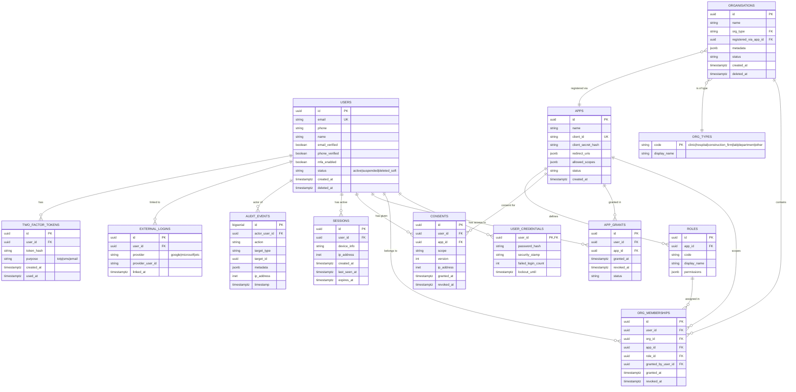

# Sangam — Multi-Tenancy and Data Model Design
## The Foundation Layer

**Version:** v0.1
**Date:** May 2026
**Stack:** PostgreSQL 16, Entity Framework Core 8, ASP.NET Core 8

---

## Why This Document Matters

Quoting from the auth library comparison document: *"The library is roughly 20% of the work. The other 80% is your data model, multi-tenancy design, and integration patterns. None of those are decided by the choice of OpenIddict vs Keycloak."*

The schema decisions in this document are the **load-bearing walls** of Sangam. Get them right and the platform flexes gracefully as you add partners, features, and use cases. Get them wrong and every future change costs 10× to retrofit.

**Read this carefully. Argue about it. Then commit before writing a line of OpenIddict code.**

---

## 1. Concepts and Terminology

Before any schema, the vocabulary needs to be precise. Misuse of words like "tenant" causes more confusion than misuse of code.

| Term | Meaning in Sangam | Examples |
|---|---|---|
| **User** | An individual human with one Sangam identity. One person = one User row, regardless of how many orgs/apps they touch. | Dr. Rajesh, Anita the project manager |
| **Organisation (Org)** | A logical group that one or more Users belong to. Organisations exist in the real world (a clinic, a construction firm, a hospital department). | "Apollo Clinic Pune", "RCC Hospital RT Dept", "ABC Constructions Ltd" |
| **OrgType** | A classification of organisation. Used for filtering and metadata. | clinic, hospital, hospital_department, construction_firm, lab, education |
| **App / Partner App** | A registered software application that uses Sangam for identity. Each App has its own OIDC client credentials. | App A (HIS), App B (Compliance), App C (Nuclear Medicine) |
| **OrgMembership** | The relationship that says "this User belongs to this Org with this Role, in the context of this App." | "Dr. Rajesh is Admin of Apollo Clinic in App A (HIS), and Viewer of the same Apollo Clinic in App B (Compliance)" |
| **AppGrant** | The relationship that says "this User has been granted access to this App." | "Dr. Rajesh has access to App A and App B but not App C" |
| **Role** | A named capability set scoped to an App. Defined by the App, registered with Sangam. | "admin", "doctor", "viewer", "auditor" |
| **Consent** | An explicit, timestamped record that a User agreed to share their identity with a specific App at a specific time. Versioned. | "Rajesh consented to App A on 2026-05-18T10:30:00Z, consent version v3" |
| **Session** | An active login session of a User. Tied to a device and IP. | "Rajesh logged in from Chrome on Windows at 09:00, expires 21:00" |
| **AuditEvent** | An append-only record of a significant action in the system. | "User Rajesh logged in", "Admin Arun changed Org Apollo's name" |
| **Tenant** | ⚠️ **Avoid this word.** It's overloaded. Use "Organisation" or "Partner App" instead, depending on what you mean. |

**Critical disambiguation:** "Multi-tenancy" in Sangam has TWO layers:

1. **Partner App tenancy** — Sangam serves multiple Partner Apps (HIS, Compliance, etc.). Each Partner App has its own clients, redirect URIs, scopes, and brand.
2. **Organisation tenancy** — Within any one Partner App, multiple Organisations operate independently. Apollo Clinic and Fortis Clinic are both clients of App A (HIS), but their data and members don't mix.

Sangam needs both. Most identity platforms only do one or the other. Keep this distinction sharp throughout.

---

## 2. Design Principles

These principles drove every schema decision below. When in doubt during implementation, return to these.

1. **A User has one identity, period.** Even if they belong to 5 orgs across 4 apps, there is exactly one Users row for them. Email is the natural key.

2. **Identity data is shared; domain data is not.** Sangam holds identity, profile, org membership, consent, audit. Domain data (clinical, project, compliance) lives in each Partner App's own database, keyed by Sangam's user_id.

3. **Email/phone identifies, authentication authorises.** Matching an email never grants access — only successful authentication does. Never link an app to a user just because the email matched.

4. **Roles are per (User, Org, App).** The same person can be Admin of Org X in App A and Viewer of Org X in App B. Don't conflate.

5. **Consent is per (User, App), versioned.** Every time the consent terms change, a new version is captured. Old consents are preserved (audit), new consents are prompted.

6. **All sensitive operations leave an AuditEvent.** No silent state changes. The audit log is the source of truth for "what happened."

7. **Soft delete first, hard delete after grace period.** Users can recover accidentally-deleted accounts within 30 days. After that, hard deletion (cascade) with audit-log pseudonymisation.

8. **Time is UTC at storage layer, local at presentation layer.** Always store `timestamptz` in Postgres; format to user's locale only at display.

9. **Foreign keys are enforced at the DB level.** Always. No "soft" relationships.

10. **Schema migrations are versioned and reviewed.** EF Core migrations checked into git, code-reviewed like any other code.

---

## 3. Entity-Relationship Diagram



---

## 4. Detailed Table Specifications

### 4.1 Users

The single source of truth for identity. **One row per human, ever.**

```sql
CREATE TABLE users (
    id              uuid        PRIMARY KEY DEFAULT gen_random_uuid(),
    email           varchar(255) NOT NULL UNIQUE,
    email_normalized varchar(255) NOT NULL UNIQUE,  -- for case-insensitive lookup
    phone           varchar(20),
    phone_normalized varchar(20),
    name            varchar(200) NOT NULL,
    email_verified  boolean     NOT NULL DEFAULT false,
    phone_verified  boolean     NOT NULL DEFAULT false,
    mfa_enabled     boolean     NOT NULL DEFAULT false,
    locale          varchar(10) NOT NULL DEFAULT 'en-IN',
    timezone        varchar(50) NOT NULL DEFAULT 'Asia/Kolkata',
    status          varchar(20) NOT NULL DEFAULT 'active',  -- active|suspended|deleted_soft|deleted_hard
    created_at      timestamptz NOT NULL DEFAULT now(),
    updated_at      timestamptz NOT NULL DEFAULT now(),
    deleted_at      timestamptz,
    CONSTRAINT chk_status CHECK (status IN ('active','suspended','deleted_soft','deleted_hard'))
);

CREATE INDEX idx_users_email_normalized ON users(email_normalized) WHERE status != 'deleted_hard';
CREATE INDEX idx_users_phone_normalized ON users(phone_normalized) WHERE phone IS NOT NULL AND status != 'deleted_hard';
CREATE INDEX idx_users_status ON users(status);
```

**Notes:**
- `email_normalized` is `LOWER(TRIM(email))`. Always look up via this column to prevent case-sensitivity bugs.
- `phone_normalized` is E.164 format (e.g., `+919876543210`). Strip spaces, dashes, parens.
- Deleted users retain a row with `status='deleted_hard'` for FK integrity in audit logs. Email is overwritten with a pseudonym like `deleted_<uuid>@example.invalid` to satisfy the unique constraint while preserving audit history.
- `locale` and `timezone` enable proper localisation when UI is multi-lingual (v1+).

### 4.2 User Credentials (separated for security)

Keeping credentials in a separate table reduces accidental exposure in queries and logs.

```sql
CREATE TABLE user_credentials (
    user_id            uuid        PRIMARY KEY REFERENCES users(id) ON DELETE CASCADE,
    password_hash      varchar(500) NOT NULL,
    security_stamp     varchar(100) NOT NULL,  -- invalidates all sessions when changed
    failed_login_count int         NOT NULL DEFAULT 0,
    lockout_until      timestamptz,
    last_password_change_at timestamptz NOT NULL DEFAULT now()
);
```

**Notes:**
- `password_hash` uses Argon2id via ASP.NET Core Identity defaults. Minimum 64 chars after encoding.
- `security_stamp` is a random GUID rotated on password change, email change, or admin force-logout. All active sessions check this stamp; mismatch = forced re-login.
- `lockout_until` enables exponential backoff after failed attempts.

### 4.3 Organisations

```sql
CREATE TABLE organisations (
    id                      uuid        PRIMARY KEY DEFAULT gen_random_uuid(),
    name                    varchar(200) NOT NULL,
    org_type                varchar(50)  NOT NULL REFERENCES org_types(code),
    registered_via_app_id   uuid        NOT NULL REFERENCES apps(id),
    metadata                jsonb       NOT NULL DEFAULT '{}',
    status                  varchar(20) NOT NULL DEFAULT 'active',
    created_at              timestamptz NOT NULL DEFAULT now(),
    updated_at              timestamptz NOT NULL DEFAULT now(),
    deleted_at              timestamptz,
    CONSTRAINT chk_org_status CHECK (status IN ('active','suspended','deleted_soft','deleted_hard'))
);

CREATE INDEX idx_org_name ON organisations(LOWER(name)) WHERE status = 'active';
CREATE INDEX idx_org_type ON organisations(org_type);
CREATE INDEX idx_org_registered_via_app ON organisations(registered_via_app_id);
```

**Notes:**
- `registered_via_app_id` records which App first registered this org. Used at exit time (Founder Agreement Section 9.2) to determine data ownership on partner exit.
- `metadata` is a flexible JSONB column for app-specific organisation attributes (license number, GSTIN, address, etc.). Avoid bloating the core schema.
- An organisation is NOT scoped to a single app. Apollo Clinic can be used by both HIS and Compliance apps via separate OrgMemberships.

### 4.4 Org Types (reference table)

```sql
CREATE TABLE org_types (
    code         varchar(50)  PRIMARY KEY,
    display_name varchar(200) NOT NULL,
    description  text
);

INSERT INTO org_types (code, display_name) VALUES
    ('clinic',              'Clinic / Practice'),
    ('hospital',            'Hospital'),
    ('hospital_department', 'Hospital Department'),
    ('lab',                 'Diagnostic Laboratory'),
    ('construction_firm',   'Construction Firm'),
    ('education',           'Educational Institution'),
    ('other',               'Other');
```

Reference table seeded at deploy. Adding new types is a migration, not a runtime operation — keeps the taxonomy disciplined.

### 4.5 Apps

```sql
CREATE TABLE apps (
    id                     uuid         PRIMARY KEY DEFAULT gen_random_uuid(),
    name                   varchar(100) NOT NULL,
    display_name           varchar(200) NOT NULL,
    client_id              varchar(100) NOT NULL UNIQUE,
    client_secret_hash     varchar(500) NOT NULL,  -- bcrypt or argon2 of the actual secret
    redirect_uris          jsonb        NOT NULL DEFAULT '[]',  -- array of URIs
    post_logout_redirect_uris jsonb     NOT NULL DEFAULT '[]',
    allowed_scopes         jsonb        NOT NULL DEFAULT '["openid","profile","email","orgs"]',
    require_consent        boolean      NOT NULL DEFAULT true,
    branding               jsonb        NOT NULL DEFAULT '{}',  -- logo url, primary colour, support email
    status                 varchar(20)  NOT NULL DEFAULT 'active',
    owner_company_name     varchar(200), -- which founder's company runs this app (for exit/admin clarity)
    created_at             timestamptz  NOT NULL DEFAULT now(),
    updated_at             timestamptz  NOT NULL DEFAULT now()
);
```

**Notes:**
- `client_secret_hash` — never store the secret in plaintext. Hash it on creation, validate by re-hashing on each token request.
- Redirect URIs strictly validated at `/authorize` — exact match, not pattern.
- `owner_company_name` makes operational ownership clear (essential for exit clauses).

### 4.6 Roles (per App)

Each App defines its own role taxonomy. Sangam doesn't impose roles; it stores the registered ones.

```sql
CREATE TABLE roles (
    id            uuid         PRIMARY KEY DEFAULT gen_random_uuid(),
    app_id        uuid         NOT NULL REFERENCES apps(id) ON DELETE CASCADE,
    code          varchar(50)  NOT NULL,
    display_name  varchar(200) NOT NULL,
    description   text,
    permissions   jsonb        NOT NULL DEFAULT '[]',  -- opaque to Sangam; meaningful to the App
    is_system     boolean      NOT NULL DEFAULT false, -- e.g., 'app_admin' role created automatically
    created_at    timestamptz  NOT NULL DEFAULT now(),
    UNIQUE (app_id, code)
);
```

**Example roles for App A (HIS):**
- `(app_a, 'org_admin', 'Organisation Admin', '["org:manage","user:invite"]')`
- `(app_a, 'doctor', 'Doctor', '["patient:read","patient:write","prescription:write"]')`
- `(app_a, 'nurse', 'Nurse', '["patient:read","vitals:write"]')`
- `(app_a, 'viewer', 'Viewer', '["patient:read"]')`

Permissions are *opaque to Sangam*. The App interprets them. Sangam just stores and propagates them in tokens.

### 4.7 OrgMemberships (the heart of the model)

This is the most-queried table. Get its design right.

```sql
CREATE TABLE org_memberships (
    id                   uuid        PRIMARY KEY DEFAULT gen_random_uuid(),
    user_id              uuid        NOT NULL REFERENCES users(id) ON DELETE CASCADE,
    org_id               uuid        NOT NULL REFERENCES organisations(id) ON DELETE CASCADE,
    app_id               uuid        NOT NULL REFERENCES apps(id) ON DELETE CASCADE,
    role_id              uuid        NOT NULL REFERENCES roles(id),
    granted_by_user_id   uuid        REFERENCES users(id),
    granted_at           timestamptz NOT NULL DEFAULT now(),
    revoked_at           timestamptz,
    UNIQUE (user_id, org_id, app_id) WHERE revoked_at IS NULL
);

CREATE INDEX idx_memb_user ON org_memberships(user_id) WHERE revoked_at IS NULL;
CREATE INDEX idx_memb_org ON org_memberships(org_id) WHERE revoked_at IS NULL;
CREATE INDEX idx_memb_app ON org_memberships(app_id) WHERE revoked_at IS NULL;
CREATE INDEX idx_memb_user_app ON org_memberships(user_id, app_id) WHERE revoked_at IS NULL;
```

**Critical design points:**

1. **The unique constraint is on `(user_id, org_id, app_id)`, not `(user_id, org_id)`.** This enables the "Rajesh is admin in HIS but viewer in Compliance for the same clinic" scenario.

2. **`revoked_at` for soft delete.** Never `DELETE` a membership row; set `revoked_at`. Audit trail intact. Re-granting later creates a *new* row.

3. **Partial unique index** (`WHERE revoked_at IS NULL`) lets you have historical revoked memberships AND a current active one for the same triple. Otherwise the unique constraint would block re-granting.

4. **`role_id` references roles, which references apps.** Means role changes flow naturally and you can't accidentally assign App B's role in an App A context.

### 4.8 App Grants

The simpler "this user has access to this app" record. Useful when you want to know "all apps Rajesh can access" without joining through orgs (e.g., for the consent screen).

```sql
CREATE TABLE app_grants (
    id            uuid        PRIMARY KEY DEFAULT gen_random_uuid(),
    user_id       uuid        NOT NULL REFERENCES users(id) ON DELETE CASCADE,
    app_id        uuid        NOT NULL REFERENCES apps(id) ON DELETE CASCADE,
    granted_at    timestamptz NOT NULL DEFAULT now(),
    revoked_at    timestamptz,
    UNIQUE (user_id, app_id) WHERE revoked_at IS NULL
);

CREATE INDEX idx_grants_user ON app_grants(user_id) WHERE revoked_at IS NULL;
```

**Relationship to org_memberships:** An AppGrant is required for an OrgMembership to be effective. If Rajesh's AppGrant to App A is revoked, all his App A memberships are effectively dormant (token issuance for App A would deny). You can enforce this in application logic or via a trigger.

### 4.9 Consents

```sql
CREATE TABLE consents (
    id            uuid        PRIMARY KEY DEFAULT gen_random_uuid(),
    user_id       uuid        NOT NULL REFERENCES users(id) ON DELETE CASCADE,
    app_id        uuid        NOT NULL REFERENCES apps(id) ON DELETE CASCADE,
    scope         varchar(500) NOT NULL,  -- the scope string consented to
    consent_version varchar(20) NOT NULL, -- which version of the consent terms
    ip_address    inet,
    user_agent    text,
    granted_at    timestamptz NOT NULL DEFAULT now(),
    revoked_at    timestamptz
);

CREATE INDEX idx_consents_user_app ON consents(user_id, app_id) WHERE revoked_at IS NULL;
```

**Notes:**
- A new consent row per `(user_id, app_id, consent_version)` combination — history is preserved.
- Revoking creates `revoked_at` timestamp; the App's tokens stop being issued until re-consent.
- When the T&C changes (new `consent_version`), users are prompted to re-consent at next login.

### 4.10 Sessions

```sql
CREATE TABLE sessions (
    id              uuid        PRIMARY KEY DEFAULT gen_random_uuid(),
    user_id         uuid        NOT NULL REFERENCES users(id) ON DELETE CASCADE,
    device_info     varchar(500),
    ip_address      inet,
    created_at      timestamptz NOT NULL DEFAULT now(),
    last_seen_at    timestamptz NOT NULL DEFAULT now(),
    expires_at      timestamptz NOT NULL,
    revoked_at      timestamptz
);

CREATE INDEX idx_sessions_user ON sessions(user_id) WHERE revoked_at IS NULL AND expires_at > now();
CREATE INDEX idx_sessions_expired ON sessions(expires_at) WHERE revoked_at IS NULL;
```

A nightly job purges sessions where `expires_at < now() - interval '30 days'`.

### 4.11 External Logins (for v1 social login)

```sql
CREATE TABLE external_logins (
    id                uuid        PRIMARY KEY DEFAULT gen_random_uuid(),
    user_id           uuid        NOT NULL REFERENCES users(id) ON DELETE CASCADE,
    provider          varchar(50) NOT NULL,  -- 'google','microsoft','linkedin'
    provider_user_id  varchar(200) NOT NULL,
    linked_at         timestamptz NOT NULL DEFAULT now(),
    UNIQUE (provider, provider_user_id)
);
```

Wired up in v1 if social login is enabled. v0 keeps the table empty.

### 4.12 Two-Factor Tokens

```sql
CREATE TABLE two_factor_tokens (
    id            uuid        PRIMARY KEY DEFAULT gen_random_uuid(),
    user_id       uuid        NOT NULL REFERENCES users(id) ON DELETE CASCADE,
    token_hash    varchar(500) NOT NULL,
    purpose       varchar(20) NOT NULL,  -- 'email_verification','password_reset','mfa_otp','phone_otp'
    expires_at    timestamptz NOT NULL,
    used_at       timestamptz,
    created_at    timestamptz NOT NULL DEFAULT now()
);

CREATE INDEX idx_2ft_user_purpose ON two_factor_tokens(user_id, purpose) WHERE used_at IS NULL;
```

Tokens hashed at rest (never store the raw 6-digit code). Compared via constant-time hash.

### 4.13 Audit Events

Append-only. The most important table for compliance.

```sql
CREATE TABLE audit_events (
    id              bigserial   PRIMARY KEY,
    actor_user_id   uuid        REFERENCES users(id),
    actor_type      varchar(20) NOT NULL DEFAULT 'user',  -- user|system|admin|api
    action          varchar(100) NOT NULL,  -- e.g., 'user.login.success'
    target_type     varchar(50),  -- 'user','organisation','app','consent','session'
    target_id       uuid,
    metadata        jsonb       NOT NULL DEFAULT '{}',
    ip_address      inet,
    user_agent      text,
    timestamp       timestamptz NOT NULL DEFAULT now()
);

CREATE INDEX idx_audit_actor ON audit_events(actor_user_id, timestamp DESC);
CREATE INDEX idx_audit_target ON audit_events(target_type, target_id, timestamp DESC);
CREATE INDEX idx_audit_action ON audit_events(action, timestamp DESC);
CREATE INDEX idx_audit_timestamp ON audit_events(timestamp DESC);

-- Prevent updates and deletes via Postgres RLS or trigger:
CREATE RULE audit_no_update AS ON UPDATE TO audit_events DO INSTEAD NOTHING;
CREATE RULE audit_no_delete AS ON DELETE TO audit_events DO INSTEAD NOTHING;
```

**Action taxonomy (sample):**
- `user.register`, `user.email.verify`, `user.login.success`, `user.login.fail`, `user.logout`, `user.password.change`, `user.password.reset.request`, `user.password.reset.complete`
- `user.mfa.enable`, `user.mfa.disable`
- `user.account.deletion.request`, `user.account.deletion.complete`
- `org.create`, `org.update`, `org.delete`
- `org_membership.grant`, `org_membership.revoke`, `org_membership.role.change`
- `app.register`, `app.secret.rotate`, `app.disable`
- `consent.grant`, `consent.revoke`, `consent.re_prompt`
- `session.create`, `session.revoke`
- `admin.user.suspend`, `admin.user.force_logout`

**Retention:** 5 years minimum for healthcare-related events (anything where the actor or target touches a healthcare app). 1 year for other events.

---

## 5. Token Claims — What Gets Put in ID Tokens

When App A asks Sangam to log in user Rajesh, Sangam returns an ID token. Here's exactly what goes in it:

```json
{
  "iss": "https://sangam.in",
  "sub": "u_5d4e3a2b-9c8d-7f6e-5d4c-3b2a1f0e9d8c",
  "aud": "app_a_his",
  "exp": 1747584000,
  "iat": 1747580400,
  "auth_time": 1747580400,
  "email": "rajesh@apolloclinic.in",
  "email_verified": true,
  "phone_number": "+919876543210",
  "phone_number_verified": true,
  "name": "Dr. Rajesh Kumar",
  "locale": "en-IN",

  // Sangam-specific claims
  "sangam_user_id": "u_5d4e3a2b-9c8d-7f6e-5d4c-3b2a1f0e9d8c",
  "sangam_app_id": "app_a_his",
  "sangam_orgs": [
    {
      "org_id": "o_apollo_pune",
      "org_name": "Apollo Clinic Pune",
      "org_type": "clinic",
      "role": "doctor",
      "permissions": ["patient:read", "patient:write", "prescription:write"]
    },
    {
      "org_id": "o_apollo_mumbai",
      "org_name": "Apollo Clinic Mumbai",
      "org_type": "clinic",
      "role": "viewer",
      "permissions": ["patient:read"]
    }
  ],
  "sangam_consent_version": "v3"
}
```

**Notes:**
- Only orgs/roles **scoped to the requesting app** are included. App A doesn't see Rajesh's App B memberships.
- Permissions array is verbatim from the role definition — Sangam doesn't interpret it.
- `sub` is the stable Sangam user_id. The App should key its own user records to this.

---

## 6. Critical Query Patterns

Performance lives or dies by these. Plan indexes around them.

### 6.1 At Login: "Resolve this user's full context for this app"

```sql
SELECT 
    u.id, u.email, u.name, u.email_verified,
    o.id AS org_id, o.name AS org_name, o.org_type,
    r.code AS role_code, r.permissions
FROM users u
LEFT JOIN org_memberships m ON m.user_id = u.id AND m.app_id = :app_id AND m.revoked_at IS NULL
LEFT JOIN organisations o ON o.id = m.org_id AND o.status = 'active'
LEFT JOIN roles r ON r.id = m.role_id
WHERE u.id = :user_id
  AND u.status = 'active'
  AND EXISTS (
    SELECT 1 FROM app_grants g 
    WHERE g.user_id = u.id AND g.app_id = :app_id AND g.revoked_at IS NULL
  )
  AND EXISTS (
    SELECT 1 FROM consents c 
    WHERE c.user_id = u.id AND c.app_id = :app_id 
      AND c.revoked_at IS NULL
      AND c.consent_version = :current_consent_version
  );
```

Returns the data needed to build the ID token. Hits `idx_memb_user_app` for the join.

### 6.2 "All orgs this user belongs to across all apps"

```sql
SELECT DISTINCT o.id, o.name, o.org_type
FROM org_memberships m
JOIN organisations o ON o.id = m.org_id
WHERE m.user_id = :user_id 
  AND m.revoked_at IS NULL
  AND o.status = 'active';
```

For the user's self-service page.

### 6.3 "All users who can access this app"

```sql
SELECT u.id, u.email, u.name
FROM users u
JOIN app_grants g ON g.user_id = u.id
WHERE g.app_id = :app_id
  AND g.revoked_at IS NULL
  AND u.status = 'active';
```

For admin UI app-level user list.

### 6.4 "Has this user consented to this app at the current version?"

```sql
SELECT EXISTS (
  SELECT 1 FROM consents
  WHERE user_id = :user_id 
    AND app_id = :app_id
    AND consent_version = :current_version
    AND revoked_at IS NULL
);
```

Called on every authorize request. Make this fast — index on `(user_id, app_id) WHERE revoked_at IS NULL`.

### 6.5 "Audit trail for this user"

```sql
SELECT timestamp, action, target_type, target_id, metadata, ip_address
FROM audit_events
WHERE actor_user_id = :user_id
ORDER BY timestamp DESC
LIMIT 200;
```

For data export (DPDPA right of access). Uses `idx_audit_actor`.

---

## 7. Edge Cases — What Could Go Wrong

These are the scenarios that break naive designs. Handle them deliberately.

### 7.1 Same email, different humans
**Scenario:** Two people share `rajesh@gmail.com` (rare but happens in family scenarios with shared email).
**Decision:** One email = one Sangam User. If they need separate identities, they need separate emails. Document this in T&C. Phone-based identification can supplement.

### 7.2 User changes email
**Scenario:** Rajesh moves jobs, his email changes from `rajesh@apolloclinic.in` to `rajesh@fortishospital.in`.
**Decision:** Allow email change. Update `users.email` and `users.email_normalized`. Audit logged. Send confirmation to OLD email (security). Send verification to NEW email. SecurityStamp rotates → all sessions invalidated → forces re-login.

### 7.3 Same person at two organisations
**Scenario:** Rajesh works at Apollo (full-time) and Fortis (visiting consultant). Both use App A.
**Decision:** Two OrgMemberships, both active, different `org_id`. The ID token includes both. App A's UI shows an "Org switcher" — user picks active context.

### 7.4 Org name collision
**Scenario:** Two people each try to register "Apollo Clinic" as a new org.
**Decision:** Allow it. Org names are not unique. Use `org_id` for everything. Show org name + city + maybe registration date in disambiguation UIs.

### 7.5 User deletes account while they're an org admin
**Scenario:** Rajesh is the only admin of Apollo Clinic in App A. He deletes his Sangam account.
**Decision:** Sangam enforces a check: cannot delete if you're the sole `org_admin` of any active org. User must transfer admin role first OR the org must be wound down in App A first.

### 7.6 Partner app exits the platform (per founder agreement)
**Scenario:** Company A leaves Sangam.
**Process:**
1. App A's status set to `disabled`. Existing tokens still valid until expiry.
2. Export of:
   - All Users where `registered_via_app_id = app_a_id` (in their AppGrants or original signup)
   - All Organisations where `registered_via_app_id = app_a_id`
   - All AuditEvents where action involves App A
3. User notification per Founder Agreement Section 9.3.
4. After grace period: app deleted. OrgMemberships to App A are cascade-deleted (revoked_at set). Users without any remaining AppGrants are notified, kept for [180 days], then deleted.

### 7.7 Database corruption or partial restore
**Scenario:** A backup is restored for some tables but not others.
**Decision:** Backups taken as full database dumps, NOT per-table. Restores are all-or-nothing. Document this in runbook. Test it monthly.

### 7.8 Race condition: user grants consent at moment app secret rotates
**Scenario:** Consent record links to current secret which gets rotated milliseconds later.
**Decision:** Consents don't reference secrets, only `app_id`. Token issuance verifies the current secret; consent verification is separate.

### 7.9 Phone number changes country
**Scenario:** User moves from India to USA, phone changes from +91... to +1...
**Decision:** Allow with re-verification via OTP to the new number. Old number unverified.

### 7.10 User claims their data was registered without consent (DPDPA dispute)
**Scenario:** User logs in to find their identity exists, alleges they didn't register.
**Decision:**
- The audit log answers: registration event timestamp, IP, user-agent, verification email opening, etc.
- If evidence supports user's claim: account deletion immediately + DPDPA breach notification process triggered.
- If evidence refutes: response to user with the evidence; offer account deletion if they wish.

---

## 8. Multi-Tenancy Implementation Approach

### 8.1 Row-level isolation

All tables that hold tenant-scoped data have either `app_id` or `org_id` (or both) as a foreign key. **Every query in the application code must include these in the WHERE clause.** This is the primary isolation mechanism.

### 8.2 Optional: PostgreSQL Row-Level Security (RLS)

For defense-in-depth, you can enable RLS policies that enforce isolation at the DB level. Example:

```sql
ALTER TABLE org_memberships ENABLE ROW LEVEL SECURITY;

CREATE POLICY app_isolation_select ON org_memberships
    FOR SELECT
    USING (app_id::text = current_setting('app.current_app_id', true));
```

Then in application code:
```csharp
await dbContext.Database.ExecuteSqlInterpolatedAsync(
    $"SET app.current_app_id = {currentAppId}");
```

**Recommendation:** Don't enable RLS in v0. Add it in v1 once the basic isolation pattern is proven. RLS adds complexity that can mask other bugs.

### 8.3 What does NOT get tenant-scoped

The User table. Users are global to Sangam — by design, the whole point is one identity across many apps/orgs. Don't accidentally scope user lookups to a single app.

---

## 9. Migration and Evolution Strategy

### 9.1 First-time bootstrap

```
1. Run EF Core migrations to create schema
2. Seed org_types
3. Seed initial admin user (one of the founders) with hard-coded credentials, force password change on first login
4. Register the three Partner Apps with admin UI
5. Define initial roles for each app
6. Done. Production ready.
```

### 9.2 Schema changes post-launch

- Every schema change goes through EF Core migration
- Migrations are reviewed in PR
- Migrations tested on staging restore-of-prod data before production
- Never edit a committed migration; always add a new one
- Destructive migrations (drop column, rename) need 2-phase: deploy code that works without the column, then later drop the column

### 9.3 Adding a fourth Partner App (new Partner Company)

```
1. Founder Agreement amended to admit new Partner (per Section 8 of Founder Agreement)
2. Sangam admin registers the new App in admin UI
3. New App publishes its public roles
4. Existing users get a notification: "A new partner has joined. You can choose to grant access if you wish."
5. Existing users are NOT auto-granted access. Each user must explicitly link to the new App.
6. Privacy Policy updated to list the new Partner. Consent version bumped. Existing users re-consent at next login.
```

This is the safe, DPDPA-defensible way. The alternative — auto-granting based on prior "consent to future partners" language — is legally risky and we recommend against it.

---

## 10. Performance Considerations

At Sangam's scale (1,000-5,000 users), every query is sub-millisecond with the indexes above. Don't pre-optimise.

**The two operations that need to be fast:**

1. **Token issuance at `/token`.** This is in the critical login path. Target: < 100ms. Achieved easily with the schema above; verified via load testing in Sprint 5.

2. **Consent check at `/authorize`.** Same target. Same answer.

**Cache strategy (v1+):**
- Cache user-to-org-memberships mapping in Redis with TTL of 5 minutes. Invalidate on membership change.
- Cache app metadata (rarely changes). Invalidate on app update.
- Never cache anything sensitive (tokens, secrets).

In v0, no Redis. In-memory caching in the ASP.NET Core process is fine for sub-5,000-user scale.

---

## 11. Data Retention and Deletion

Per DPDPA and the T&C:

| Data Type | Retention | Deletion Trigger |
|---|---|---|
| Active user records | While account active | User-initiated deletion |
| Soft-deleted users | 30 days | Auto hard-delete after 30 days |
| Hard-deleted users | Tombstone row only | Permanent (preserves FK integrity in audit) |
| Sessions | Until expiry + 30 days | Nightly job |
| OTP tokens | 1 hour after creation OR after use | Nightly job |
| Audit events (healthcare-linked) | 5 years | Automated archival to cold storage after 5 years |
| Audit events (other) | 1 year | Same |
| Consent records | While user is active + 7 years after (legal evidence) | Anonymisation after retention |
| Email verification, password reset tokens | 24 hours OR after use | Nightly job |

**Hard delete cascade order:**
1. Sessions
2. Two-factor tokens
3. External logins
4. Consents (mark anonymised, keep row for audit)
5. App grants (revoked_at set, keep row)
6. Org memberships (revoked_at set, keep row)
7. User credentials
8. User row (status set to deleted_hard, email pseudonymised)

---

## 12. Open Design Questions (decide before implementation)

These are items where reasonable people can disagree. The three founders should pick before code is written.

1. **Roles: per-app fixed list, or per-org custom?** Recommended: per-app fixed list in v0 (simpler). Custom per-org roles in v1+ if needed.

2. **Org admin model: a single `org_admin` user, or "anyone with org_admin role"?** Recommended: anyone with the role. Don't designate single owners.

3. **Can a user belong to zero organisations?** Recommended: yes. Some apps may have individual users (no org context). Roles for such users would be platform-defined "individual" role.

4. **Phone uniqueness: enforce or not?** Recommended: NOT unique (families share phones). Email remains the unique identifier.

5. **Email-only or email+phone for login?** Recommended: email-only for v0. Phone login in v1.

6. **Org hierarchies?** Recommended: flat in v0. Parent-child orgs (hospital → departments) in v1.

7. **Bulk operations?** Recommended: not in v0. Single-user operations only. Bulk import/invite in v1.

8. **Anonymous events in audit?** Recommended: yes. Some events have no actor (system events). Use `actor_type='system'`, `actor_user_id IS NULL`.

---

## 13. Final Sanity-Check Before Implementation

Before you write the first EF Core entity, walk through these scenarios mentally with this schema. If any of them feel hard, the schema needs adjustment first.

- [ ] **User registers via App A** — creates User, AppGrant for App A, Consent for App A, OrgMembership if joining an org.
- [ ] **User later signs into App B** — must explicitly grant App B access. Creates AppGrant for App B, Consent for App B, OrgMembership(s) for orgs they choose. App A access untouched.
- [ ] **User is admin of Clinic X in App A and viewer of the same Clinic X in App B** — two OrgMembership rows, same `user_id` and `org_id`, different `app_id` and `role_id`. No conflict.
- [ ] **User leaves Clinic X but stays at Clinic Y** — set `revoked_at` on the Clinic X OrgMembership. Clinic Y untouched. User can re-join Clinic X later (new row).
- [ ] **Admin promotes Rajesh from doctor to org_admin in HIS** — soft-revoke the doctor row, create new row with org_admin role. History preserved.
- [ ] **User deletes account** — soft delete (30 days), then hard delete cascading through all linked tables, with audit pseudonymisation.
- [ ] **Partner C exits the platform** — App C disabled, users registered via App C exported to Company C, audit preserved, other users notified.

If all these feel clean with this schema, you're ready. If any feels awkward, fix it now — not after 10,000 rows exist.

---

*End of multi-tenancy and data model design document.*

*This completes the three-document set: Legal Scaffolding, V0 Sprint Plan, Multi-Tenancy and Data Model. Read in this order, then go build.*
