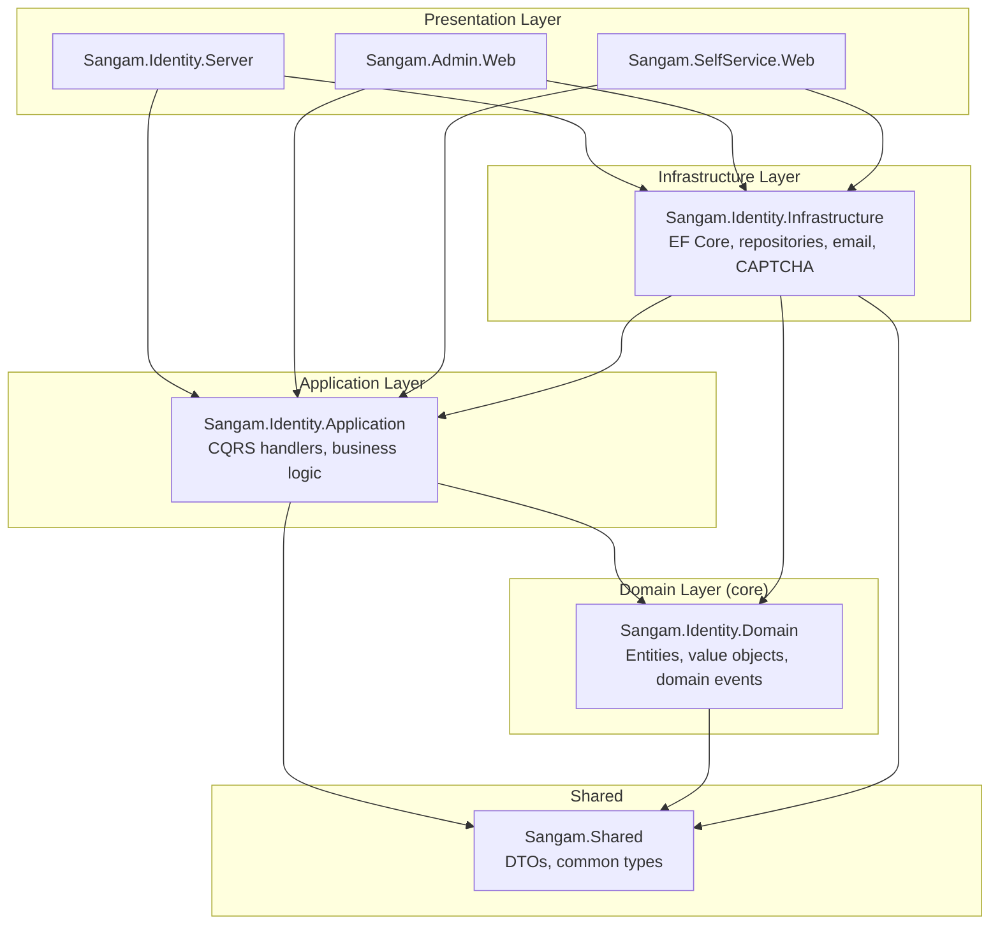

# Sangam — Project Structure
## .NET Solution Layout and Conventions

**Version:** v0.1
**Date:** May 2026
**Stack:** .NET 8 LTS, ASP.NET Core, Blazor Server, OpenIddict, Entity Framework Core, PostgreSQL

---

## 1. Repository Layout (Top Level)

The repository is mono-repo style — one repo containing all Sangam server-side projects plus the client SDK. Partner apps (LiPi, HIS, Compliance) live in their own repositories owned by each founder's company.

```
sangam-platform/                          ← the main repo (Apache 2.0)
│
├── .github/
│   ├── workflows/
│   │   ├── ci.yml                       ← build + test on every PR
│   │   ├── docker-build.yml             ← build container images on main
│   │   └── codeql.yml                   ← security scan weekly
│   ├── ISSUE_TEMPLATE/
│   │   ├── bug_report.md
│   │   └── feature_request.md
│   └── PULL_REQUEST_TEMPLATE.md
│
├── docs/                                ← documentation
│   ├── architecture/
│   │   ├── overview.md
│   │   ├── data-model.md
│   │   └── adr/                         ← Architecture Decision Records
│   │       ├── 0001-use-openiddict.md
│   │       ├── 0002-postgresql-shared-instance.md
│   │       └── ...
│   ├── integration/                     ← for partner app developers
│   │   ├── getting-started.md
│   │   ├── oidc-flow.md
│   │   ├── claims-reference.md
│   │   └── troubleshooting.md
│   ├── operations/                      ← runbooks
│   │   ├── deployment.md
│   │   ├── backup-restore.md
│   │   ├── incident-response.md
│   │   └── on-call.md
│   └── README.md
│
├── src/                                 ← all production code
│   ├── Sangam.Identity.Domain/          ← business entities (no dependencies)
│   ├── Sangam.Identity.Application/     ← business logic, CQRS handlers
│   ├── Sangam.Identity.Infrastructure/  ← EF Core, external services
│   ├── Sangam.Identity.Server/          ← OIDC server (ASP.NET Core host)
│   ├── Sangam.Admin.Web/                ← Blazor Server admin UI
│   ├── Sangam.SelfService.Web/          ← Blazor Server self-service UI
│   ├── Sangam.Shared/                   ← shared kernel (DTOs, common types)
│   └── Sangam.Client/                   ← NuGet SDK for partner apps
│
├── tests/                               ← all test projects (mirror src/)
│   ├── Sangam.Identity.Domain.Tests/
│   ├── Sangam.Identity.Application.Tests/
│   ├── Sangam.Identity.Infrastructure.Tests/
│   ├── Sangam.Identity.Server.Tests/
│   ├── Sangam.Admin.Web.Tests/
│   ├── Sangam.SelfService.Web.Tests/
│   ├── Sangam.Client.Tests/
│   └── Sangam.IntegrationTests/         ← end-to-end OIDC flow tests
│
├── deploy/                              ← infrastructure as code
│   ├── docker-compose.yml               ← production stack
│   ├── docker-compose.staging.yml
│   ├── docker-compose.dev.yml           ← local development
│   ├── Dockerfile.identity              ← image for Identity.Server
│   ├── Dockerfile.admin                 ← image for Admin.Web
│   ├── Dockerfile.selfservice           ← image for SelfService.Web
│   ├── caddy/
│   │   └── Caddyfile                    ← reverse proxy + SSL config
│   ├── postgres/
│   │   └── init.sql                     ← bootstrap DB and users
│   └── scripts/
│       ├── backup.sh
│       └── restore.sh
│
├── samples/                             ← example partner-app integrations
│   ├── LipiSampleIntegration/           ← minimal ASP.NET Core app using Sangam.Client
│   └── BlazorSampleIntegration/
│
├── scripts/                             ← development scripts
│   ├── bootstrap-dev.sh                 ← one-shot local setup
│   ├── seed-data.sh                     ← seed dev DB with test users
│   └── generate-client-secret.sh
│
├── .editorconfig                        ← coding style enforced by IDE
├── .gitignore
├── .gitattributes
├── Directory.Build.props                ← solution-wide MSBuild settings
├── Directory.Packages.props             ← Central Package Management (NuGet versions)
├── Sangam.sln                           ← Visual Studio / Rider solution file
├── README.md                            ← project overview, quickstart
├── LICENSE                              ← Apache 2.0 text
├── CONTRIBUTING.md                      ← how to contribute (for future OSS contributors)
├── CODE_OF_CONDUCT.md                   ← Contributor Covenant
├── SECURITY.md                          ← responsible disclosure policy
└── CHANGELOG.md                         ← semver-tracked release notes
```

---

## 2. Architectural Layers

Sangam follows **Clean Architecture** (Onion Architecture). Three principles:

1. **Dependencies point inward.** Outer layers depend on inner layers, never the reverse.
2. **The Domain layer has zero dependencies.** No EF Core, no ASP.NET, no anything except .NET base libraries.
3. **The Application layer defines interfaces; Infrastructure implements them.** Domain logic doesn't know about Postgres or SMTP.

Layered diagram:



Why this matters: when you swap PostgreSQL for SQL Server, only `Sangam.Identity.Infrastructure` changes. When you swap OpenIddict for Duende later, only `Sangam.Identity.Server` changes. The Domain and Application layers stay intact through major refactors.

---

## 3. Each Project In Detail

### 3.1 Sangam.Identity.Domain

**Purpose:** Core business entities and rules. No dependencies on EF Core, ASP.NET Core, or anything outside .NET base libraries.

**Folder structure:**

```
Sangam.Identity.Domain/
├── Entities/
│   ├── User.cs
│   ├── UserCredentials.cs
│   ├── Organisation.cs
│   ├── OrgMembership.cs
│   ├── App.cs
│   ├── Role.cs
│   ├── AppGrant.cs
│   ├── Consent.cs
│   ├── Session.cs
│   ├── ExternalLogin.cs
│   ├── TwoFactorToken.cs
│   └── AuditEvent.cs
├── ValueObjects/
│   ├── Email.cs                         ← validates format on construction
│   ├── PhoneNumber.cs                   ← E.164 normalisation
│   ├── OrgType.cs
│   ├── ConsentScope.cs
│   └── PermissionSet.cs
├── Enums/
│   ├── UserStatus.cs
│   ├── OrgStatus.cs
│   ├── AuditAction.cs
│   └── ActorType.cs
├── Events/                              ← domain events
│   ├── UserRegisteredEvent.cs
│   ├── UserEmailVerifiedEvent.cs
│   ├── ConsentGrantedEvent.cs
│   ├── ConsentRevokedEvent.cs
│   ├── OrgMembershipGrantedEvent.cs
│   └── ...
├── Exceptions/
│   ├── DomainException.cs
│   ├── UserAlreadyExistsException.cs
│   ├── InvalidEmailException.cs
│   └── ...
├── Specifications/                      ← query specifications
│   ├── ActiveUsersSpec.cs
│   ├── UserByEmailSpec.cs
│   └── ...
└── Sangam.Identity.Domain.csproj
```

**Sample entity (`User.cs`):**

```csharp
namespace Sangam.Identity.Domain.Entities;

public class User : Entity, IAggregateRoot
{
    public Guid Id { get; private set; }
    public Email Email { get; private set; }
    public PhoneNumber? Phone { get; private set; }
    public string Name { get; private set; }
    public bool EmailVerified { get; private set; }
    public bool PhoneVerified { get; private set; }
    public bool MfaEnabled { get; private set; }
    public string Locale { get; private set; } = "en-IN";
    public string Timezone { get; private set; } = "Asia/Kolkata";
    public UserStatus Status { get; private set; }
    public DateTimeOffset CreatedAt { get; private set; }
    public DateTimeOffset UpdatedAt { get; private set; }
    public DateTimeOffset? DeletedAt { get; private set; }

    // Private constructor for EF Core
    private User() { }

    public static User Register(Email email, string name)
    {
        var user = new User
        {
            Id = Guid.NewGuid(),
            Email = email,
            Name = name,
            Status = UserStatus.Active,
            CreatedAt = DateTimeOffset.UtcNow,
            UpdatedAt = DateTimeOffset.UtcNow
        };
        user.AddDomainEvent(new UserRegisteredEvent(user.Id, email));
        return user;
    }

    public void VerifyEmail()
    {
        if (EmailVerified) return;
        EmailVerified = true;
        UpdatedAt = DateTimeOffset.UtcNow;
        AddDomainEvent(new UserEmailVerifiedEvent(Id));
    }

    public void SoftDelete()
    {
        Status = UserStatus.DeletedSoft;
        DeletedAt = DateTimeOffset.UtcNow;
        UpdatedAt = DateTimeOffset.UtcNow;
    }

    // ... more methods, all with domain logic and event raising
}
```

**Key conventions:**
- Private setters on all properties. Mutations only through methods.
- Domain methods raise domain events; handlers in Application layer dispatch side effects.
- Value objects validate on construction (an invalid `Email` cannot exist).
- No `public new User() { ... }` constructors. Use static factory methods (`Register`, `Create`, `From...`).

---

### 3.2 Sangam.Identity.Application

**Purpose:** Application services, CQRS commands and queries, business orchestration. Knows about domain. Doesn't know about EF Core or HTTP.

**Folder structure:**

```
Sangam.Identity.Application/
├── Common/
│   ├── Interfaces/                      ← abstractions that Infrastructure implements
│   │   ├── IUserRepository.cs
│   │   ├── IOrgRepository.cs
│   │   ├── IEmailSender.cs
│   │   ├── ICaptchaService.cs
│   │   ├── IPasswordHasher.cs
│   │   ├── ITokenGenerator.cs
│   │   ├── IAuditLogger.cs
│   │   └── IUnitOfWork.cs
│   ├── Behaviours/                      ← MediatR pipeline behaviours
│   │   ├── LoggingBehaviour.cs
│   │   ├── ValidationBehaviour.cs
│   │   └── PerformanceBehaviour.cs
│   ├── Exceptions/
│   │   ├── ValidationException.cs
│   │   ├── NotFoundException.cs
│   │   └── ForbiddenException.cs
│   └── Mappings/
│       └── MappingProfile.cs            ← AutoMapper profiles (optional)
├── Users/
│   ├── Commands/
│   │   ├── RegisterUser/
│   │   │   ├── RegisterUserCommand.cs
│   │   │   ├── RegisterUserCommandHandler.cs
│   │   │   └── RegisterUserCommandValidator.cs    ← FluentValidation
│   │   ├── VerifyEmail/
│   │   ├── ResetPassword/
│   │   ├── ChangePassword/
│   │   ├── SoftDeleteUser/
│   │   └── ...
│   ├── Queries/
│   │   ├── GetUserById/
│   │   ├── GetUserByEmail/
│   │   ├── ListUsers/
│   │   └── ...
│   └── EventHandlers/
│       ├── UserRegisteredEventHandler.cs    ← sends welcome email
│       └── UserEmailVerifiedEventHandler.cs
├── Organisations/
│   ├── Commands/
│   ├── Queries/
│   └── EventHandlers/
├── Apps/
│   ├── Commands/
│   └── Queries/
├── Consents/
│   ├── Commands/
│   ├── Queries/
│   └── EventHandlers/
├── Tokens/
│   ├── IssueTokenCommand.cs
│   └── ValidateTokenQuery.cs
├── Audit/
│   └── (audit-specific queries)
├── DependencyInjection.cs               ← AddApplication() extension
└── Sangam.Identity.Application.csproj
```

**Sample command handler:**

```csharp
namespace Sangam.Identity.Application.Users.Commands.RegisterUser;

public class RegisterUserCommandHandler : IRequestHandler<RegisterUserCommand, Guid>
{
    private readonly IUserRepository _userRepo;
    private readonly IPasswordHasher _passwordHasher;
    private readonly ICaptchaService _captcha;
    private readonly IUnitOfWork _uow;

    public RegisterUserCommandHandler(
        IUserRepository userRepo,
        IPasswordHasher passwordHasher,
        ICaptchaService captcha,
        IUnitOfWork uow)
    {
        _userRepo = userRepo;
        _passwordHasher = passwordHasher;
        _captcha = captcha;
        _uow = uow;
    }

    public async Task<Guid> Handle(RegisterUserCommand request, CancellationToken ct)
    {
        var captchaOk = await _captcha.VerifyAsync(request.CaptchaToken, request.ClientIp);
        if (!captchaOk)
            throw new ValidationException("CAPTCHA failed");

        var email = Email.Create(request.Email);
        if (await _userRepo.ExistsByEmailAsync(email, ct))
            throw new UserAlreadyExistsException(email);

        var user = User.Register(email, request.Name);
        var credentials = UserCredentials.Create(user.Id, _passwordHasher.Hash(request.Password));

        await _userRepo.AddAsync(user, ct);
        await _userRepo.AddCredentialsAsync(credentials, ct);
        await _uow.SaveChangesAsync(ct);   // dispatches domain events

        return user.Id;
    }
}
```

**Key conventions:**
- Each command/query is its own folder with command + handler + validator.
- Use **MediatR** for command/query dispatch (industry standard, plays well with pipeline behaviours).
- Use **FluentValidation** for input validation (FluentValidation pipeline behaviour runs all validators before the handler).
- Cross-cutting concerns (logging, validation, performance) are MediatR pipeline behaviours, applied automatically.

---

### 3.3 Sangam.Identity.Infrastructure

**Purpose:** Concrete implementations of Application interfaces. EF Core, email, CAPTCHA, secrets.

**Folder structure:**

```
Sangam.Identity.Infrastructure/
├── Persistence/
│   ├── ApplicationDbContext.cs          ← EF Core DbContext
│   ├── Configurations/                  ← entity configurations
│   │   ├── UserConfiguration.cs
│   │   ├── OrganisationConfiguration.cs
│   │   ├── AppConfiguration.cs
│   │   ├── OrgMembershipConfiguration.cs
│   │   └── ...
│   ├── Migrations/                      ← EF Core migrations (auto-generated)
│   ├── Repositories/
│   │   ├── UserRepository.cs
│   │   ├── OrgRepository.cs
│   │   └── ...
│   ├── Interceptors/
│   │   ├── DomainEventDispatcher.cs     ← raises events on SaveChanges
│   │   └── AuditableEntityInterceptor.cs
│   └── UnitOfWork.cs
├── Identity/
│   ├── PasswordHasher.cs                ← Argon2id via Konscious.Security.Cryptography
│   ├── TokenGenerator.cs                ← cryptographically secure random tokens
│   └── SecurityStampGenerator.cs
├── Email/
│   ├── BrevoEmailSender.cs              ← primary provider
│   ├── ResendEmailSender.cs             ← backup
│   ├── EmailTemplates/                  ← MJML / Razor templates
│   │   ├── VerificationEmail.cshtml
│   │   ├── PasswordResetEmail.cshtml
│   │   └── NewSignInAlert.cshtml
│   └── IEmailTemplateRenderer.cs
├── Captcha/
│   ├── CloudflareTurnstileService.cs    ← primary
│   └── HCaptchaService.cs               ← backup
├── Audit/
│   └── AuditLogger.cs
├── BackgroundJobs/
│   ├── ExpireTokensJob.cs               ← nightly cleanup
│   ├── PurgeSoftDeletedUsersJob.cs
│   ├── SendReminderEmailsJob.cs
│   └── BackupVerificationJob.cs
├── Configuration/
│   ├── DatabaseOptions.cs
│   ├── EmailOptions.cs
│   ├── CaptchaOptions.cs
│   └── SecurityOptions.cs
├── DependencyInjection.cs               ← AddInfrastructure() extension
└── Sangam.Identity.Infrastructure.csproj
```

**Sample DbContext snippet:**

```csharp
public class ApplicationDbContext : DbContext, IUnitOfWork
{
    public DbSet<User> Users => Set<User>();
    public DbSet<Organisation> Organisations => Set<Organisation>();
    public DbSet<App> Apps => Set<App>();
    public DbSet<OrgMembership> OrgMemberships => Set<OrgMembership>();
    // ... and so on

    protected override void OnModelCreating(ModelBuilder builder)
    {
        builder.ApplyConfigurationsFromAssembly(typeof(ApplicationDbContext).Assembly);
        base.OnModelCreating(builder);
    }

    public async Task<int> SaveChangesAsync(CancellationToken ct = default)
    {
        // Domain events dispatched via interceptor
        return await base.SaveChangesAsync(ct);
    }
}
```

---

### 3.4 Sangam.Identity.Server

**Purpose:** The OIDC server. ASP.NET Core host. Configures OpenIddict. Handles `/authorize`, `/token`, `/userinfo`, `/logout`, registration, password reset, consent UI.

**Folder structure:**

```
Sangam.Identity.Server/
├── Endpoints/                           ← minimal API endpoints
│   ├── Authorization/
│   │   └── AuthorizeEndpoint.cs
│   ├── Token/
│   │   └── TokenEndpoint.cs
│   ├── UserInfo/
│   │   └── UserInfoEndpoint.cs
│   └── Registration/
│       ├── RegisterEndpoint.cs
│       ├── VerifyEmailEndpoint.cs
│       └── ResetPasswordEndpoint.cs
├── Pages/                               ← Razor Pages for UI flows
│   ├── Login.cshtml
│   ├── Login.cshtml.cs
│   ├── Register.cshtml
│   ├── Register.cshtml.cs
│   ├── VerifyEmail.cshtml
│   ├── ForgotPassword.cshtml
│   ├── ResetPassword.cshtml
│   ├── Consent.cshtml
│   ├── Logout.cshtml
│   ├── Error.cshtml
│   └── Shared/
│       ├── _Layout.cshtml
│       ├── _ValidationScriptsPartial.cshtml
│       └── _PartnerAppBanner.cshtml
├── wwwroot/                             ← static assets
│   ├── css/
│   │   ├── site.css
│   │   └── themes/
│   │       ├── sangam-default.css
│   │       └── partner-overrides.css    ← injected per app
│   ├── js/
│   │   ├── turnstile-init.js
│   │   └── form-helpers.js
│   ├── images/
│   │   ├── sangam-logo.svg
│   │   └── partners/                    ← partner logos uploaded by admin
│   └── favicon.ico
├── Theming/
│   ├── IPartnerThemeProvider.cs
│   └── PartnerThemeProvider.cs          ← resolves app_id → theme CSS
├── Middleware/
│   ├── RateLimitingMiddleware.cs
│   ├── SecurityHeadersMiddleware.cs
│   └── PartnerContextMiddleware.cs      ← extracts client_id, loads theme
├── Filters/
│   └── ValidationFilter.cs
├── appsettings.json
├── appsettings.Development.json
├── appsettings.Production.json
├── Program.cs                           ← composition root
└── Sangam.Identity.Server.csproj
```

**Why Razor Pages and not Blazor for the auth screens?**

Auth screens need to work without JavaScript (for accessibility and for edge cases where JS is blocked). Razor Pages renders server-side HTML reliably. Blazor Server depends on a SignalR connection that may not be available pre-auth. For the user-facing self-service portal (post-auth), Blazor Server is fine.

This is a deliberate split: Razor Pages for unauthenticated flows, Blazor Server for authenticated UIs.

---

### 3.5 Sangam.Admin.Web

**Purpose:** Operator admin UI. Blazor Server app. Used by the three founders to manage users, orgs, apps, audit log.

**Folder structure:**

```
Sangam.Admin.Web/
├── Components/
│   ├── App.razor
│   ├── Routes.razor
│   ├── _Imports.razor
│   ├── Pages/
│   │   ├── Dashboard.razor
│   │   ├── Users/
│   │   │   ├── UserList.razor
│   │   │   ├── UserDetail.razor
│   │   │   └── UserEdit.razor
│   │   ├── Organisations/
│   │   ├── Apps/
│   │   │   ├── AppList.razor
│   │   │   ├── AppDetail.razor
│   │   │   ├── AppRegister.razor
│   │   │   └── AppSecretRotate.razor
│   │   ├── Roles/
│   │   ├── Audit/
│   │   │   ├── AuditLog.razor
│   │   │   └── AuditExport.razor
│   │   └── Settings/
│   ├── Shared/
│   │   ├── MainLayout.razor
│   │   ├── NavMenu.razor
│   │   └── LoginRequired.razor
│   └── Common/
│       ├── DataTable.razor
│       ├── ConfirmDialog.razor
│       ├── SearchInput.razor
│       └── DateTimeDisplay.razor
├── wwwroot/
│   ├── css/
│   │   ├── site.css
│   │   └── mudblazor-overrides.css
│   └── images/
├── Services/                            ← client-side services (call Application via DI)
│   ├── UserAdminService.cs
│   ├── AppAdminService.cs
│   └── AuditService.cs
├── Authentication/
│   ├── AdminAuthHandler.cs
│   └── MfaPolicyProvider.cs             ← enforces MFA for all admin routes
├── appsettings.json
├── Program.cs
└── Sangam.Admin.Web.csproj
```

**Key tech:**
- **MudBlazor** as the component library (free, MIT, comprehensive).
- All routes gated behind `[Authorize(Policy = "AdminWithMfa")]`.
- Admin authentication itself uses Sangam's OIDC server (eat your own dog food).

---

### 3.6 Sangam.SelfService.Web

**Purpose:** End-user self-service portal at `account.sangam.in`. Blazor Server. Users view/edit profile, manage consents, see sessions, export data, delete account.

**Folder structure (similar to Admin.Web but user-facing):**

```
Sangam.SelfService.Web/
├── Components/
│   ├── App.razor
│   ├── Routes.razor
│   ├── Pages/
│   │   ├── Dashboard.razor
│   │   ├── Profile.razor
│   │   ├── Security.razor               ← password, MFA, sessions
│   │   ├── LinkedApps.razor
│   │   ├── Organisations.razor
│   │   ├── PrivacyAndData.razor         ← export, delete
│   │   └── Settings.razor
│   └── Shared/
│       └── MainLayout.razor
├── wwwroot/
├── Services/
├── Authentication/                      ← user auth via Sangam OIDC
├── appsettings.json
├── Program.cs
└── Sangam.SelfService.Web.csproj
```

---

### 3.7 Sangam.Shared

**Purpose:** DTOs and common types shared across boundaries (Server ↔ Admin ↔ SelfService ↔ Client SDK).

```
Sangam.Shared/
├── Dtos/
│   ├── UserDto.cs
│   ├── OrganisationDto.cs
│   ├── AppDto.cs
│   └── ConsentDto.cs
├── Constants/
│   ├── Scopes.cs                        ← "openid", "profile", "email", "orgs"
│   ├── Claims.cs                        ← custom claim names
│   └── AuditActions.cs
├── Results/
│   ├── Result.cs                        ← Result<T> pattern for fallible operations
│   └── PaginatedList.cs
└── Sangam.Shared.csproj
```

Why a separate Shared project? Avoids circular dependencies. Both Server and Client SDK can reference DTOs without pulling in the entire domain or application layer.

---

### 3.8 Sangam.Client (NuGet SDK)

**Purpose:** The NuGet package partner apps install (`dotnet add package Sangam.Client`). Thin wrapper around `Microsoft.AspNetCore.Authentication.OpenIdConnect` with Sangam-specific helpers.

**Folder structure:**

```
Sangam.Client/
├── Configuration/
│   ├── SangamClientOptions.cs           ← config struct: Authority, ClientId, Secret, etc.
│   └── SangamClientOptionsValidator.cs
├── Authentication/
│   ├── SangamAuthenticationExtensions.cs    ← AddSangamAuth() extension method
│   ├── SangamClaimsTransformer.cs            ← maps Sangam claims to .NET claims
│   └── SangamCookieEvents.cs
├── Models/
│   ├── SangamUser.cs                    ← strongly-typed user from token
│   ├── SangamOrgContext.cs              ← orgs and roles
│   └── SangamPermissions.cs
├── Extensions/
│   ├── ClaimsPrincipalExtensions.cs     ← .GetOrgs(), .HasRole(), .GetPermissions()
│   └── HttpContextExtensions.cs
├── README.md                            ← integration guide
└── Sangam.Client.csproj
```

**Sample usage (in a partner app like LiPi):**

```csharp
// Program.cs in LiPi
builder.Services.AddSangamAuth(options =>
{
    options.Authority = "https://id.sangam.in";
    options.ClientId = "lipi";
    options.ClientSecret = builder.Configuration["Sangam:ClientSecret"];
    options.CallbackPath = "/auth/callback";
    options.Scopes = new[] { "openid", "profile", "email", "orgs" };
});

// In a controller
public IActionResult Dashboard()
{
    var orgs = User.GetOrgs();             // extension from Sangam.Client
    var isAdmin = User.HasRoleInOrg("org_admin", orgId);
    return View(new DashboardViewModel { Orgs = orgs, IsAdmin = isAdmin });
}
```

The whole point of this package: partner devs add 5-10 lines to their app and they're integrated. No OIDC plumbing.

---

## 4. Solution-Wide Settings

### 4.1 Directory.Build.props (applies to all projects)

```xml
<Project>
  <PropertyGroup>
    <TargetFramework>net8.0</TargetFramework>
    <Nullable>enable</Nullable>
    <ImplicitUsings>enable</ImplicitUsings>
    <TreatWarningsAsErrors>true</TreatWarningsAsErrors>
    <LangVersion>latest</LangVersion>
    <GenerateDocumentationFile>true</GenerateDocumentationFile>
    <NoWarn>$(NoWarn);1591</NoWarn>
    <ManagePackageVersionsCentrally>true</ManagePackageVersionsCentrally>
  </PropertyGroup>
</Project>
```

Nullable reference types ON. Warnings as errors. .NET 8 LTS. Documentation generation enabled (for the public Client SDK).

### 4.2 Directory.Packages.props (centralised NuGet versions)

```xml
<Project>
  <ItemGroup>
    <PackageVersion Include="OpenIddict.AspNetCore" Version="5.x.x" />
    <PackageVersion Include="OpenIddict.EntityFrameworkCore" Version="5.x.x" />
    <PackageVersion Include="Microsoft.AspNetCore.Identity.EntityFrameworkCore" Version="8.x.x" />
    <PackageVersion Include="Npgsql.EntityFrameworkCore.PostgreSQL" Version="8.x.x" />
    <PackageVersion Include="MediatR" Version="12.x.x" />
    <PackageVersion Include="FluentValidation" Version="11.x.x" />
    <PackageVersion Include="Serilog.AspNetCore" Version="8.x.x" />
    <PackageVersion Include="MudBlazor" Version="6.x.x" />
    <PackageVersion Include="Konscious.Security.Cryptography.Argon2" Version="1.x.x" />
    <PackageVersion Include="MailKit" Version="4.x.x" />
    <PackageVersion Include="xunit" Version="2.x.x" />
    <PackageVersion Include="FluentAssertions" Version="6.x.x" />
    <PackageVersion Include="Testcontainers.PostgreSql" Version="3.x.x" />
    <!-- ... -->
  </ItemGroup>
</Project>
```

Centralised version management — change a package version in one place, all projects update. Industry-standard approach since .NET 6+.

### 4.3 .editorconfig

Enforces consistent code style across IDEs. Key rules:
- 4-space indentation for C#, 2-space for JSON/YAML/XML
- File-scoped namespaces
- `var` for local variables when type is apparent
- Trailing commas in multi-line collections
- Blank line between members
- No `this.` qualifier
- Sort using directives, System first

Full file in the repo. Picked up by Visual Studio, Rider, VS Code with the C# extension.

---

## 5. Testing Structure

Each `src/Project` has a corresponding `tests/Project.Tests` project. Three categories:

### 5.1 Unit tests
Test single classes in isolation. No DB, no HTTP, no external services.

```
Sangam.Identity.Domain.Tests/
├── Entities/
│   ├── UserTests.cs
│   └── OrganisationTests.cs
├── ValueObjects/
│   ├── EmailTests.cs
│   └── PhoneNumberTests.cs
└── Sangam.Identity.Domain.Tests.csproj
```

### 5.2 Integration tests
Test the application + infrastructure layers against a real PostgreSQL via **Testcontainers** (spins up a real Postgres in Docker for each test run).

```
Sangam.IntegrationTests/
├── Fixtures/
│   └── DatabaseFixture.cs               ← Testcontainers Postgres setup
├── Users/
│   ├── RegisterUserTests.cs
│   └── LoginTests.cs
├── OidcFlow/
│   └── EndToEndAuthFlowTests.cs         ← full /authorize → /token → /userinfo
└── Sangam.IntegrationTests.csproj
```

### 5.3 UI/component tests
Blazor components tested with **bUnit**.

```
Sangam.Admin.Web.Tests/
├── Pages/
│   └── UserListTests.cs
└── Components/
    └── DataTableTests.cs
```

### 5.4 Test conventions

- Test class named `[ClassUnderTest]Tests`
- Test method named `[MethodName]_[Scenario]_[ExpectedOutcome]`. Example: `Register_WithExistingEmail_ThrowsUserAlreadyExistsException`
- Use **xUnit** + **FluentAssertions** (more readable than NUnit's Assert syntax)
- No mocking framework needed for most tests — prefer real implementations via dependency injection containers in tests
- Aim for >80% line coverage on Domain and Application layers; Infrastructure can be lower (mostly tested via integration tests)

---

## 6. CI/CD Pipeline

`.github/workflows/ci.yml`:

```yaml
name: CI
on:
  pull_request:
  push:
    branches: [main]

jobs:
  build-and-test:
    runs-on: ubuntu-latest
    services:
      postgres:
        image: postgres:16
        env:
          POSTGRES_PASSWORD: postgres
        options: --health-cmd pg_isready --health-interval 10s
    steps:
      - uses: actions/checkout@v4
      - uses: actions/setup-dotnet@v4
        with:
          dotnet-version: 8.0.x
      - run: dotnet restore
      - run: dotnet build --no-restore --configuration Release
      - run: dotnet test --no-build --configuration Release --collect:"XPlat Code Coverage"
      - uses: codecov/codecov-action@v4    # optional
```

Branch protection on `main`:
- Require PR review (at least one of the three founders)
- Require CI to pass
- Require linear history (rebase or squash, no merge commits)
- No force-pushes

---

## 7. Local Development Setup

A new developer (founder, contributor, future hire) should be able to run Sangam locally in under 15 minutes.

**`scripts/bootstrap-dev.sh`:**

```bash
#!/usr/bin/env bash
set -e

# 1. Check prerequisites
command -v dotnet >/dev/null || { echo "dotnet 8 SDK required"; exit 1; }
command -v docker >/dev/null || { echo "Docker required"; exit 1; }

# 2. Start local Postgres + Redis via docker-compose
docker compose -f deploy/docker-compose.dev.yml up -d postgres

# 3. Restore tools and packages
dotnet tool restore
dotnet restore

# 4. Apply EF Core migrations
dotnet ef database update --project src/Sangam.Identity.Infrastructure --startup-project src/Sangam.Identity.Server

# 5. Seed test data (test users, test app registrations)
./scripts/seed-data.sh

# 6. Print next steps
echo "Setup complete."
echo "  dotnet run --project src/Sangam.Identity.Server      → starts auth server"
echo "  dotnet run --project src/Sangam.Admin.Web            → starts admin UI"
echo "  dotnet run --project src/Sangam.SelfService.Web      → starts self-service"
```

A new contributor clones, runs `./scripts/bootstrap-dev.sh`, and is ready to develop.

---

## 8. Naming Conventions

### Project names
`Sangam.<Component>.<Subcomponent>` — e.g., `Sangam.Identity.Domain`, `Sangam.Admin.Web`.

### Namespace
Matches project name. Folder structure within project maps to nested namespaces.

### Class names
- Entities: singular noun (`User`, `Organisation`)
- Commands: imperative verb + "Command" (`RegisterUserCommand`)
- Queries: "Get" + noun + "Query" (`GetUserByIdQuery`)
- Handlers: `<Command/Query>Handler`
- Repositories: `<Entity>Repository`
- Services: noun + "Service" (`EmailSenderService`)
- Interfaces: `I<ConcreteName>` (`IUserRepository`)

### Database
- Tables: snake_case plural (`users`, `org_memberships`)
- Columns: snake_case (`email_verified`, `created_at`)
- Indexes: `idx_<table>_<columns>`
- Foreign keys: `fk_<table>_<referenced_table>`

### Files
- C# files: `PascalCase.cs` matching the contained class
- Razor: `PascalCase.razor`
- Configurations: `appsettings.json` and `appsettings.<Environment>.json`

---

## 9. Configuration & Secrets

### 9.1 Layered configuration

ASP.NET Core's standard configuration layering applies. Sources in order of precedence (later overrides earlier):
1. `appsettings.json` (committed; non-secret defaults)
2. `appsettings.<Environment>.json` (committed; environment-specific non-secret overrides)
3. User secrets (dev only, never committed)
4. Environment variables (production)
5. Command-line arguments

### 9.2 Secrets management

**Never commit secrets to git.** Period.

- **Local dev:** Use `dotnet user-secrets` — secrets stored in `~/.microsoft/usersecrets/<id>/secrets.json`, outside the repo.
- **Staging/production:** Environment variables on the host. Loaded into a single `appsettings.Production.json.local` (gitignored) or set directly in the container.
- **v1+:** Migrate to Oracle Vault or Azure Key Vault for production secrets, with managed identity authentication.

**Secrets to track:**
- Database connection string (with password)
- OpenIddict signing key (X.509 cert)
- OpenIddict encryption key
- Email provider API key (Brevo)
- Cloudflare Turnstile secret key
- Admin user initial password (rotated on first login)
- JWT signing key (if using JWT bearer tokens beyond OIDC)

---

## 10. Open Decisions on Project Structure

Items where reasonable people may differ; the three founders should align:

1. **CQRS with MediatR, or simpler service classes?** Recommended: MediatR (the structure shown above). Alternatives: plain service classes, Vertical Slice Architecture. MediatR is industry standard for .NET in 2026; deviating costs onboarding speed for any future contributor.

2. **AutoMapper, manual mapping, or Mapperly?** Recommended: **Mapperly** (source-generator-based, compile-time, no runtime reflection). AutoMapper is mature but slower and has had recent licensing concerns. Manual mapping is fine for small projects but tedious.

3. **MudBlazor vs Radzen vs custom components?** Recommended: **MudBlazor** for both Admin and SelfService UIs. Free, MIT, comprehensive, Material Design aesthetic that pairs well with Sangam's calm authority.

4. **Razor Pages vs Blazor for auth screens?** Recommended: **Razor Pages** for the auth flows (pre-auth UIs need to work without JS). Blazor Server for post-auth UIs.

5. **Test framework: xUnit, NUnit, or MSTest?** Recommended: **xUnit + FluentAssertions**. xUnit is the modern .NET default.

6. **Docker image strategy: single image with all services, or one image per service?** Recommended: **one image per service** (identity, admin, selfservice). Cleaner separation, independent scaling later, smaller blast radius for redeploys.

7. **Branching model: GitFlow, GitHub Flow, or trunk-based?** Recommended: **GitHub Flow** for v0 (just `main` + feature branches). GitFlow is overkill for three founders. Trunk-based is great but requires more mature CD setup.

---

*End of project structure documentation.*

*Continue to `sangam-mockups.html` for visual mockups of the screens described in `sangam-ux-design-documentation.md`.*
