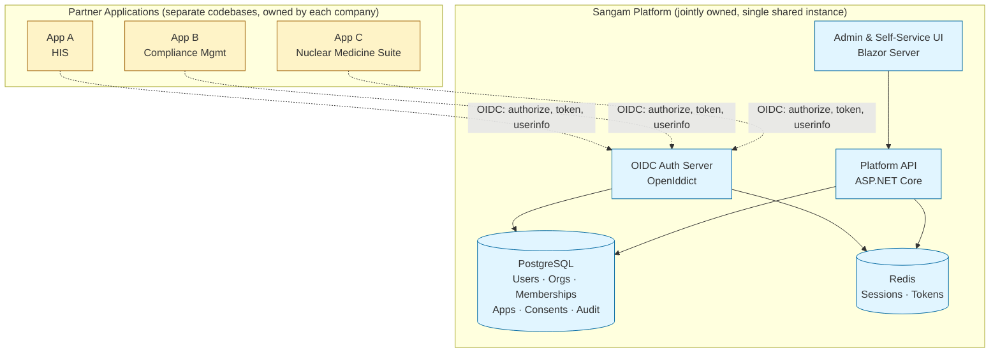

# Sangam — Shared Identity & Tenancy Platform
## Strategic Document v0.1

**Status:** Draft for review by founding partners
**Audience:** Three founding partners (Companies A, B, C)
**Working codename:** *Sangam* (Sanskrit: "confluence") — to be replaced by a jointly chosen name
**License:** Apache 2.0 (proposed)
**Date:** May 2026

---

## 1. Executive Summary

Sangam is a shared, open-source Identity and Tenancy platform that the three founding companies will jointly build, host, and operate. Each company's commercial application (HIS, Compliance Management, Project Management, Nuclear Medicine Suite) integrates with Sangam for user authentication, organisation management, and cross-app access. End users get a single identity across all partner apps; each company keeps full ownership of its domain data and monetises its own product. The platform itself does not charge users — it is plumbing, not a product.

---

## 2. Vision & Scope

**Vision.** One identity, many products. A user who registers once via any partner app can later use any other partner app without re-registering, while each partner app keeps full control over its domain logic, data, and pricing.

**In scope (the platform owns):**
- User identity (credentials, profile, contact details, verification status)
- Organisation/tenant records (clinics, construction firms, hospitals, labs)
- Memberships linking users to organisations
- Roles scoped per (user, organisation, application)
- Application registry and per-app access grants
- Consent management and audit trail
- Login, registration, password reset, MFA, session management
- Admin UI for platform operators (the three founders)
- Self-service UI for end users (profile, linked apps, consent management)
- SDK for partner apps to integrate

**Out of scope (partner apps own):**
- Domain data (clinical records, project tasks, compliance documents, etc.)
- App-specific settings, workflows, billing, reporting
- Domain-specific permissions and business rules
- Notifications other than identity-related (login alerts, password reset, etc.)

**Scope discipline is the single most important rule.** Every feature request must answer: "Does every partner app need this, or just one?" If just one, it belongs in that app, not in Sangam.

---

## 3. Guiding Principles

1. **Identity layer only.** Sangam knows *who* and *which org*; nothing more.
2. **Standards over invention.** OIDC and OAuth2 for everything. No bespoke auth protocols.
3. **Open source, joint ownership.** Apache 2.0 license, owned by a joint legal entity, not any one company.
4. **No charging end users.** Each partner monetises its own app; the platform stays free at the identity layer.
5. **Lean operations.** Single shared instance, minimum viable infrastructure, scale only when load demands.
6. **Consent is mandatory and informed.** No silent data sharing; every cross-app link requires explicit user consent.
7. **Data residency in India.** DPDPA-aligned from day one.
8. **Email/phone identifies; authentication authorises.** Never link an app to an identity based on matching email alone.

---

## 4. Technology Stack

| Layer | Choice | Rationale |
|---|---|---|
| Language / Runtime | C# / .NET 8 LTS | Founder preference; mature ecosystem; long-term support |
| Web framework | ASP.NET Core | Industry-standard, OIDC support first-class |
| Auth server | **OpenIddict 5.x** | MIT-licensed, OIDC/OAuth2 compliant, .NET-native. Avoids Duende's commercial licensing and Keycloak's JVM complexity. |
| User store | ASP.NET Core Identity | Native, battle-tested, integrates with OpenIddict |
| Admin & Self-service UI | **Blazor Server** | Stateful, better for admin UIs, simpler than WASM, server-side data access |
| UI component library | MudBlazor (MIT) | Free, comprehensive, matches Material Design |
| Database | **PostgreSQL 16** | Open-source, mature, lower cost than SQL Server for self-host. (SQL Server Express is an alternative if team continuity matters more.) |
| Cache / session store | Redis 7 | Standard for OIDC token caching; introduced in v1 (in-memory in v0) |
| ORM | Entity Framework Core | Native, code-first migrations |
| Reverse proxy / SSL | Caddy 2 | Automatic Let's Encrypt SSL, single config file |
| Email | Brevo / Resend free tier + MailKit | 300/day free, enough for our scale |
| Logging | Serilog → Seq (self-hosted) | Structured logging, single-user Seq is free |
| Monitoring | UptimeRobot (free) + ASP.NET health checks | Sufficient for our scale |
| Container runtime | Docker + Docker Compose | Portable, single-VM friendly |
| Hosting OS | Ubuntu 24.04 LTS | Stable, well-supported on Azure/E2E |
| Cloud | Azure India (primary) or E2E Networks | DPDPA-compliant data residency |

---

## 5. Architecture Overview

**Trust boundary:** Partner apps trust Sangam for "who is this user, what orgs are they in, what apps may they access." Everything else stays in the apps.

---

## 6. Feature Catalogue

### 6.1 v0 — Minimum Viable Platform (Day 0–90)

Goal: ship enough for **one** partner app to integrate and run beta users.

**Authentication**
- Email + password registration with verification email
- Login with rate limiting and lockout
- Password reset via email
- Logout with token revocation
- Session management (sliding expiry)

**OIDC / OAuth2**
- Authorization code flow with PKCE
- ID token + access token + refresh token (with rotation)
- Standard `/authorize`, `/token`, `/userinfo`, `/.well-known/openid-configuration` endpoints
- JWKS endpoint with rotating keys

**Organisations**
- Create organisation (clinic, construction firm, etc.) with type and basic metadata
- Add/remove user-to-organisation memberships
- Role assignment scoped per (user, org, app)

**Application registry**
- Register partner apps as OIDC clients
- Per-app secret, redirect URIs, allowed scopes
- Per-(user, app) access grants

**Consent**
- First-time consent screen when a user signs into a new partner app
- Stored consent record with version, scope, timestamp, IP
- Self-service revocation

**Admin UI (Blazor)**
- Platform operator login (MFA required)
- User search, view, suspend
- Organisation search, view, edit
- App registration and credential management
- Audit log viewer

**Self-service UI (Blazor)**
- User profile view/edit
- List of linked apps and consents
- Active sessions and "log out everywhere"
- Password change
- Data export (DPDPA)
- Account deletion (DPDPA)

**SDK / Integration**
- NuGet package: `Sangam.Client` — thin wrapper around `Microsoft.AspNetCore.Authentication.OpenIdConnect`
- Sample integration repo
- Integration guide (markdown)

**Operations**
- Daily PostgreSQL backup to offsite blob storage
- Health check endpoints
- Structured logging to Seq
- Uptime monitoring

**Compliance baseline**
- Privacy policy linked from registration
- Cookie consent banner
- Audit log of identity events
- Documented breach response process

### 6.2 v1 — Production Hardening (Day 90–270)

- MFA for end users (TOTP via authenticator apps)
- Magic link login (passwordless)
- Optional social login (Google) — opt-in per app
- Invite flow: org admin invites user to join an org
- Org-level branding (logo, primary colour on login screen)
- Better audit log: search, filter, CSV export
- Multi-language UI (English + Hindi minimum)
- Backup verification automation
- First independent security audit (VAPT)
- Performance metrics dashboard

### 6.3 v1.1+ — Deferred (Year 2+)

- Passkeys / WebAuthn
- SAML 2.0 support (for enterprise clients of partner apps)
- SCIM provisioning
- Federation with external IdPs (Azure AD, Okta) for enterprise tenants
- Hierarchical organisations (parent/child)
- Custom permission sets per partner app
- Mobile SDK (when partner apps go mobile-first)
- White-label per partner app
- Webhooks for identity events

---

## 7. Data Model (high level)

| Table | Purpose | Key fields |
|---|---|---|
| `Users` | Identity records | `id`, `email`, `phone`, `password_hash`, `name`, `email_verified`, `phone_verified`, `mfa_enabled`, `status`, `created_at` |
| `Organisations` | Tenant records | `id`, `name`, `type` (clinic/construction/etc.), `metadata_json`, `registered_via_app_id`, `status`, `created_at` |
| `OrgMemberships` | User ↔ Org ↔ App relationship | `user_id`, `org_id`, `app_id`, `role`, `granted_at`, `granted_by` |
| `Apps` | Registered partner applications | `id`, `name`, `client_id`, `client_secret_hash`, `redirect_uris[]`, `allowed_scopes[]`, `status` |
| `AppGrants` | User has access to App | `user_id`, `app_id`, `granted_at`, `status` |
| `Consents` | Recorded user consents | `user_id`, `app_id`, `scope`, `version`, `granted_at`, `ip`, `revoked_at` |
| `AuditEvents` | Append-only event log | `id`, `actor_id`, `action`, `target_type`, `target_id`, `timestamp`, `metadata_json` |
| `Sessions` | Active user sessions | `id`, `user_id`, `device_info`, `created_at`, `last_seen_at`, `expires_at` |

**Important design points:**

- A user's role is scoped **per (user, org, app)**, not just per (user, org). The same person can be an admin of Clinic X in HIS and a viewer of Clinic X in Compliance.
- A user can belong to multiple orgs across multiple apps. The data model is many-to-many at every level.
- `AuditEvents` is append-only — never updated, never deleted.

---

## 8. Integration Pattern

A new partner app integrates in roughly the following way:

1. Platform admin registers the app in Sangam → receives `client_id` and `client_secret`.
2. App developer installs `Sangam.Client` NuGet, configures authority URL, client ID, secret.
3. App redirects unauthenticated users to Sangam's `/authorize` endpoint.
4. User authenticates with Sangam (login or registration).
5. If first time linking to this app, user sees a consent screen naming this app and what data it will receive.
6. Sangam redirects back to the app with an authorization code.
7. App exchanges code for ID token + access token at `/token`.
8. App reads user ID, email, orgs, role from the ID token claims.
9. App creates its own app-side user record keyed to the Sangam user ID.

The user identity, org list, and role come from Sangam. Everything else — clinical records, project tasks, compliance documents — lives in the partner app's database, keyed by the Sangam user ID.

---

## 9. Infrastructure & Hosting

**v0 footprint (Year 1, ~1,000 users):**
- 1 × Linux VM (Azure B2s — 2 vCPU, 4 GB RAM) — or E2E equivalent
- Docker Compose orchestrating: auth server, admin UI, Postgres, Caddy
- Postgres on the same VM (cheap; HA can come later)
- Caddy handles SSL via Let's Encrypt
- Nightly `pg_dump` → Azure Blob Storage (cool tier)
- Single region, single instance

**Year 2 footprint (~2,000 users, 300 daily full-day active):**
- Upgrade VM to B2ms (2 vCPU, 8 GB RAM) or B4ms
- Introduce Redis as separate container
- Same single-region setup

**When to scale (not before — premature scaling kills lean platforms):**
- Move Postgres to managed service when DB > 20 GB or backup time > 30 min
- Move to multi-instance when single-VM CPU consistently > 60% for a week
- Introduce CDN when global users appear

---

## 10. Security & Compliance

**Security baseline (v0):**
- Argon2id password hashing (ASP.NET Core Identity default settings; adequate)
- Rate limiting on `/login`, `/register`, `/reset-password` (e.g., 5/min per IP)
- HTTPS only, HSTS preload
- Strict Content Security Policy on UIs
- Secrets in environment variables (move to Azure Key Vault when budget allows)
- Database encryption at rest (disk-level)
- MFA mandatory for all platform admins from day one (even before end-user MFA ships)
- No PII in logs

**DPDPA alignment:**
- Consent captured per app at first link, with version and timestamp
- "Future partners" handled via re-consent prompt on next login when new partner joins (no blanket pre-consent)
- Self-service data export (machine-readable format) within 30 days of request
- Self-service account deletion with documented cascade rules
- Documented data retention policy and breach notification process
- Designated Data Protection Officer (can be fractional, shared across the three companies)

**Healthcare considerations (since two of the three apps touch healthcare):**
- Hosted in India region only
- Audit log retention: minimum 5 years for healthcare-linked events
- Consider ISO 27001 alignment in Year 2

---

## 11. Governance, Licensing, Cost Sharing

**Legal structure:** A joint entity (LLP recommended for Indian context) owns the GitHub organisation, the domain, the cloud account, and the platform IP. The three founding companies are equal members of this entity.

**License:** Apache 2.0 — permissive, includes explicit patent grant. Allows the three companies to use commercially without obligation, allows the wider community to contribute, allows future participants to adopt without copyleft concerns.

**Cost sharing (proposed):** Equal thirds for Years 1–2 regardless of usage. Review annually. Trigger for revisiting: if any one app accounts for > 60% of platform load or > 60% of identity records for two consecutive quarters, the cost split is renegotiated.

**Decision rights:**
- Day-to-day technical decisions: rotating tech lead (6-month rotation)
- Roadmap and major architecture decisions: unanimous consent of three founders
- Tie-breaker for deadlocks: default to status quo until resolved; escalation to a pre-agreed independent advisor if deadlock persists > 30 days
- Adding a new partner company: unanimous consent required

**Exit clause (high level — full T&C drafted separately):**
- An exiting partner takes with them: identity records of users registered via their app only, and the org records they registered
- All shared platform code remains under Apache 2.0; the exiting partner can fork freely
- Users whose identity is taken receive a notification and 60-day window to object
- Exiting partner's app continues to function via their own forked or replacement identity system; no immediate cutover required

---

## 12. Roadmap & Milestones

| Month | Milestone |
|---|---|
| 1 | Joint entity formed; GitHub org created; T&C and founder agreement signed; repo skeleton with CI |
| 1–2 | Core OIDC server (OpenIddict) + ASP.NET Core Identity wired up; PostgreSQL schema; basic registration and login working |
| 2 | Admin UI (Blazor) — user management, app registration, org management |
| 2–3 | Self-service UI — profile, consents, sessions, data export |
| 3 | Consent flow, audit logging, NuGet SDK, integration documentation |
| 3 | **Integration with App #1** (pick the simplest of the three to integrate first) |
| 4 | Beta launch with limited real users on App #1; bug fixes and hardening |
| 4–5 | **Integration with App #2** |
| 5–6 | **Integration with App #3**; full launch |
| 6–9 | v1 features: MFA, magic link, invite flow, multi-language, branding |
| 9 | First VAPT (security audit) |
| 12 | Year-1 retrospective, cost split review, governance review |

---

## 13. Risks & Mitigations

| Risk | Likelihood | Impact | Mitigation |
|---|---|---|---|
| Scope creep | High | High | Strict "is this needed by all three apps?" gate; quarterly roadmap review |
| Founder disagreement on direction | Medium | High | Documented governance, rotating tech lead, advisor for tie-breaks |
| Security incident | Medium | High | Annual VAPT, MFA-only admin access, structured audit log, breach response doc |
| One partner exits messily | Low–Medium | High | T&C drafted and signed before code is written; data ownership rules explicit |
| Cloud provider lock-in | Low | Medium | Docker-based deployment — portable across Azure, E2E, AWS, on-prem |
| Performance under unexpected growth | Low | Medium | Headroom in v0 sizing; clear scale triggers in §9 |
| Open-source community contributions become unmanageable | Low | Low | Start with closed contributions; open the repo widely only after v1 |
| Compliance audit from a partner's client requires platform attestations | Medium | Medium | Maintain compliance dossier (ISMS, DPIA, audit reports) ready to share |

---

## 14. Open Decisions (to resolve before Day 1 of build)

1. **Platform name.** Three founders to agree.
2. **Legal entity type and registration state.** LLP recommended; choose registration state and engage CA.
3. **Domain name.** Register identity.[name].in (or similar).
4. **Cloud provider final call.** Azure India vs. E2E Networks — driven by total cost and existing relationships.
5. **First app to integrate.** Recommend the one with the simplest user model and lowest production traffic.
6. **Tech lead for Year 1.** Who holds the keys for the first 6 months.
7. **Database final call.** PostgreSQL (recommended) vs. SQL Server Express (if team continuity outweighs cost).
8. **Email provider.** Brevo vs. Resend vs. SendGrid — based on deliverability testing.
9. **Lawyer engagement.** Engage Indian tech-and-health lawyer to draft founder agreement and T&C.
10. **Independent advisor for tie-breaks.** Identify and confirm.

---

*End of document. v0.2 will follow once Open Decisions are resolved and feedback from the two co-founders is incorporated.*
