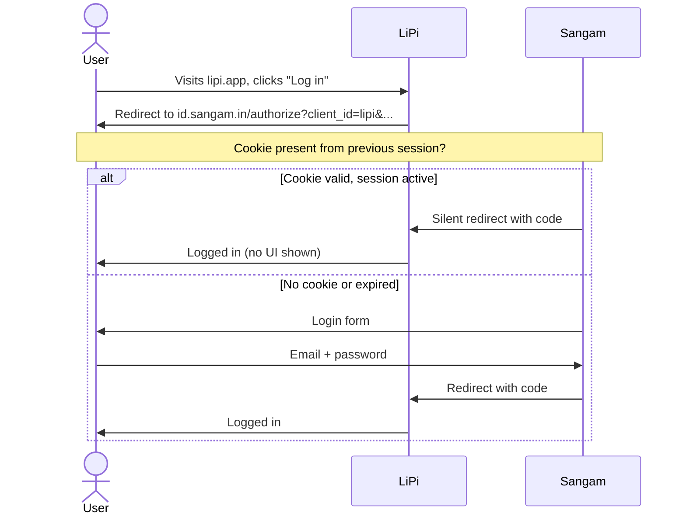
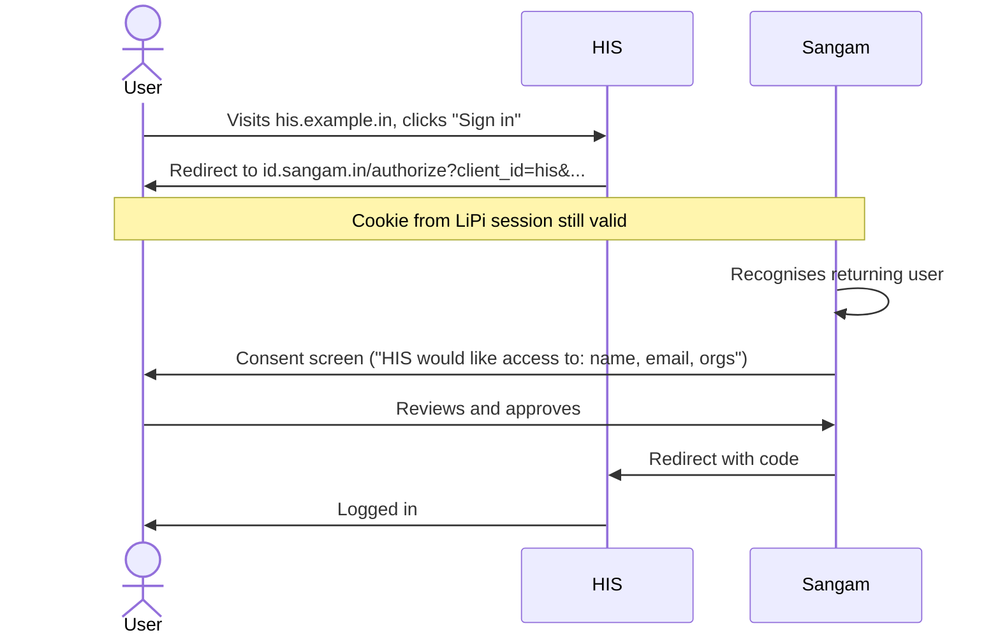

# Sangam — UX Design Documentation
## Domains, Screens, Flows, Branding

**Version:** v0.1
**Date:** May 2026
**Example partner app:** LiPi (used throughout as the worked example)

---

## 1. Domain Architecture

Sangam runs on its own domain. Each Partner Application runs on its own domain. They interact via redirects (the OIDC pattern). This separation is structural, not optional — see "Why Sangam needs its own domain" in the previous discussion.

### 1.1 Sangam's subdomain layout

| Subdomain | Purpose | Audience |
|---|---|---|
| `sangam.in` | Public marketing/info site, partner list, T&C, Privacy Policy | Anyone |
| `id.sangam.in` | Auth server — login, registration, consent, MFA | End users (transient, redirected to/from partner apps) |
| `account.sangam.in` | Self-service portal — profile, consents, sessions, data export | End users |
| `admin.sangam.in` | Operator admin UI | Only the three founders |
| `docs.sangam.in` | Integration docs for partner developers | Partner devs, future contributors |
| `api.sangam.in` | Public APIs (if any are exposed beyond OIDC) | Future use |

For v0, you only need `id.sangam.in`, `account.sangam.in`, and `admin.sangam.in`. The marketing site and docs can sit as static pages under `sangam.in` and be expanded later.

### 1.2 Partner app domains (illustrative)

| App | Domain | Operated by |
|---|---|---|
| LiPi | `lipi.app` or `lipi.in` | Arun's company |
| (HIS app) | `[company-a-his-domain]` | Founder A |
| (Compliance app) | `[company-b-compliance-domain]` | Founder B |

Partner apps own their domains entirely. Sangam never lives under a partner's domain.

### 1.3 Cookie scoping

Cookies for the Sangam session are set on `.sangam.in` (with the leading dot). This means:
- The session works across `id.sangam.in` and `account.sangam.in` — same login session.
- Partner apps (different domains) **cannot read** Sangam's cookies. They only see what's in the ID token returned to them.

This is correct and intended. It's how SSO works without leaking session state to apps.

---

## 2. User Flows

Three flows cover 95% of what users do. Master these, the rest are details.

### 2.1 First-time registration (via LiPi)

```mermaid
sequenceDiagram
    actor User
    participant LiPi as LiPi (lipi.app)
    participant Sangam as Sangam (id.sangam.in)
    participant Email as Email Provider

    User->>LiPi: Visits lipi.app
    User->>LiPi: Clicks "Get Started"
    LiPi->>User: Redirect to id.sangam.in/register?client_id=lipi&...
    User->>Sangam: Sees registration form (Sangam UI, "Creating account for LiPi" subtitle)
    User->>Sangam: Enters email, password, name; solves invisible CAPTCHA
    Sangam->>Email: Send verification email
    Sangam->>User: "Check your email"
    User->>Email: Opens email, clicks verification link
    Email->>Sangam: Redirect to id.sangam.in/verify?token=...
    Sangam->>User: "Email verified — Continue to LiPi"
    User->>Sangam: Clicks "Continue"
    Sangam->>User: Consent screen ("LiPi would like access to: name, email, orgs")
    User->>Sangam: Reviews and approves
    Sangam->>LiPi: Redirect to lipi.app/auth/callback?code=...
    LiPi->>Sangam: Exchange code for tokens
    Sangam->>LiPi: ID token + access token + refresh token
    LiPi->>User: Logged into LiPi dashboard
```

Total time: 3-4 minutes (including reading the email).

### 2.2 Returning user logs into LiPi



Total time: under 5 seconds for the silent re-auth case.

### 2.3 User registered via LiPi, now adopts a second app (say, HIS)



This is the moment Sangam earns its existence. 15 seconds, no password re-entry.

---

## 3. Page-by-Page Catalogue

Every page that exists in v0. Mockups for the most important ones are in the accompanying `sangam-mockups.html` file.

### 3.1 Sangam — Authentication Pages (`id.sangam.in`)

| Page | URL | Purpose |
|---|---|---|
| Login | `/login` (rendered at `/authorize` redirect) | Email + password, "Forgot password?" link, link to register |
| Register | `/register` (entered from partner app's signup) | Email, password, name, ToS acceptance, CAPTCHA |
| Email verification sent | `/verify-sent` | Confirms email was sent, "Resend" option |
| Email verification confirmed | `/verify?token=...` | "You're verified — Continue to LiPi" |
| Password reset request | `/forgot-password` | Email input, CAPTCHA |
| Password reset confirmation | `/reset-password?token=...` | New password form |
| Consent screen | `/consent` (mid-flow) | Shows what partner app is requesting, list of all partners, scope details, approve/decline |
| MFA challenge (v1) | `/mfa` | OTP entry |
| Logout confirmation | `/logout` | "You're logged out — return to LiPi" |
| Error | `/error` | Generic OIDC error page |

### 3.2 Sangam — Self-Service Pages (`account.sangam.in`)

All require authentication.

| Page | URL | Purpose |
|---|---|---|
| Dashboard | `/` | Summary: linked apps, recent logins, profile completeness |
| Profile | `/profile` | View/edit name, email, phone (with re-verification) |
| Security | `/security` | Change password, set up MFA, view active sessions, "Log out everywhere" |
| Linked apps | `/apps` | List of partner apps user has consented to; revoke access per app |
| Organisations | `/organisations` | List of orgs user belongs to, role in each, app context |
| Privacy & Data | `/privacy` | Download data (DPDPA), delete account, consent history |
| Settings | `/settings` | Locale, timezone, notification preferences |

### 3.3 Sangam — Admin Pages (`admin.sangam.in`)

All require admin authentication + MFA mandatory.

| Page | URL | Purpose |
|---|---|---|
| Dashboard | `/` | Operational health: total users, daily logins, error rates, uptime |
| Users | `/users` | Search, view, suspend, force-logout |
| Organisations | `/organisations` | Search, view, edit, soft-delete |
| Apps | `/apps` | Register new app, manage credentials, rotate secrets, set redirect URIs |
| Roles | `/roles` | Per-app role definitions |
| Audit log | `/audit` | Search, filter, export |
| Consent versions | `/consent-versions` | Manage privacy policy versions, trigger re-consent prompts |
| Settings | `/settings` | Platform-wide settings |

### 3.4 LiPi (Partner App) — Reference Pages

What LiPi itself shows. Not Sangam's concern, but worth noting for the boundary.

| Page | URL | Purpose |
|---|---|---|
| Landing | `lipi.app` | Marketing, product info, "Get Started" / "Log in" buttons |
| Auth callback | `lipi.app/auth/callback` | OIDC callback endpoint — invisible to user, technical only |
| Dashboard | `lipi.app/dashboard` | LiPi's actual product UI (after login) |
| All other LiPi product pages | various | LiPi's domain entirely |

---

## 4. Branding Strategy

Sangam serves multiple Partner Apps. Its branding must be **welcoming to each partner's users without competing with the partner's brand**. Three layers of branding work in concert:

### 4.1 Sangam's own brand

Used on `sangam.in` (marketing), `account.sangam.in` (self-service), `admin.sangam.in` (admin), and as the *default* theme for `id.sangam.in` when there's no per-app override.

**Design principles for Sangam:**
- **Quiet authority.** It's identity infrastructure. Trustworthy, not flashy.
- **Slight Indian cultural rooting.** The name is Sanskrit; a subtle nod (a Devanagari accent in the wordmark, ink-inspired colour palette) without being overtly themed.
- **Restraint.** Plenty of negative space. Minimal ornamentation. Sharp typography.

**Visual language (suggested):**
- Wordmark: **Sangam** with a small Devanagari "स" (or the chosen final name's Devanagari character) as a decorative bullet
- Primary colour: Deep ink-teal (#0B4F6C)
- Secondary: Warm cream (#F5F1E8)
- Accent: Soft vermillion (#C97B6E) — used sparingly for CTAs
- Display typography: Cormorant Garamond (serif, literary) or similar
- Body typography: Inter Tight, DM Sans, or Manrope (clean, modern)

### 4.2 Per-app theming on `id.sangam.in`

When a user is redirected to Sangam from LiPi, the login screen subtly reflects LiPi without becoming LiPi.

What changes:
- LiPi's logo appears top-right or as a "Logging in to LiPi" header
- The primary button colour can match LiPi's primary (with contrast checks)
- A small "back to LiPi" link

What does NOT change:
- The Sangam wordmark (small, but always visible — users must know they're on a shared identity service)
- The page structure
- The footer (with links to Sangam's T&C, Privacy, support)
- The typography (mostly — display font stays Sangam's; LiPi's font isn't loaded for performance)

**This balance protects users.** If a phishing site spoofed `id.sangam.in`, the user might not notice the missing partner branding. The Sangam wordmark + URL bar are the *constant* trust signals. Per-app theming is decoration on top.

### 4.3 Partner app's own brand (LiPi)

LiPi owns its landing page, marketing, product dashboard, and everything except the auth flow. When user clicks "Get Started" on `lipi.app`, they leave LiPi visually until they finish auth and return.

**Implications for LiPi (and any partner):**
- The "Get Started" / "Log in" buttons are LiPi-branded
- The auth screens are Sangam-branded (with LiPi accents)
- The post-login dashboard is fully LiPi-branded
- The "Log out" button on LiPi redirects to Sangam's `/logout`, which then bounces back to LiPi's landing page

This is the same pattern as "Sign in with Google" — the auth screens are Google's, the rest is the app's. Users understand it.

### 4.4 LiPi as the worked example — visual identity

Based on Arun's design brief, LiPi's brand evokes Indian writing traditions and uses scripts from Devanagari, Tamil, Bangla, and others.

**Working palette for LiPi (illustrative — Arun will refine):**
- Primary: Deep indigo (#1A1F4A) — like manuscript ink
- Secondary: Burnt saffron (#C97B3C) — warmth, tradition
- Background: Warm parchment (#F7F2E8)
- Text: Deep charcoal (#2A2522)
- Accent: Rich sindoor red (#A8323A) — used in moments of emphasis

**Typography:**
- Display: Editorial serif (Italiana, Cormorant Garamond, or EB Garamond)
- Body: Mukta or Hind (sans serif with full Devanagari support)
- Script accents: actual Devanagari/Tamil/Bangla characters used as decorative elements

The mockups (see `sangam-mockups.html`) show LiPi's landing page using this palette and Sangam's auth flow themed with LiPi's primary colour.

---

## 5. CAPTCHA Implementation

### 5.1 Where CAPTCHA fires

| Endpoint | Trigger | CAPTCHA type |
|---|---|---|
| `POST /register` | Always | Invisible (Turnstile) |
| `POST /login` | After 2 failed attempts from same IP OR against same account in 10 minutes | Invisible, falls back to interactive |
| `POST /forgot-password` | Always | Invisible |
| `POST /resend-verification` | After 1 attempt within 5 minutes | Invisible |
| `POST /mfa/request-otp` | After 2 attempts within 5 minutes | Invisible |
| `POST /admin/*` | Never (admin auth is gated separately by IP allowlist + MFA) | n/a |

### 5.2 Why Cloudflare Turnstile

Recommended primary: **Cloudflare Turnstile**.

- Free, unlimited usage
- Invisible by default (most users never see a challenge)
- No user tracking (privacy-friendly, DPDPA-aligned)
- Strong bot detection
- Works behind Cloudflare's free DDoS protection (bonus)

Backup: **hCaptcha** if Cloudflare isn't preferred.

Avoid: **Google reCAPTCHA** for an Indian healthcare-adjacent platform — Google's data flow creates DPDPA disclosure obligations.

### 5.3 Implementation pattern

```csharp
// In Sangam.Identity.Server, registration endpoint
[HttpPost("/register")]
public async Task<IActionResult> Register(RegisterDto model)
{
    // Verify Turnstile token server-side
    var captchaValid = await _captchaService.VerifyAsync(
        model.TurnstileToken, HttpContext.Connection.RemoteIpAddress);
    
    if (!captchaValid)
    {
        return BadRequest("CAPTCHA verification failed. Please try again.");
    }
    
    // Continue with registration...
}
```

Site key is public (in the client-side JS), secret key is in server config. Verification call to Turnstile is a single POST request.

### 5.4 Accessibility considerations

Invisible CAPTCHA fails for some users (screen readers, users with privacy extensions, Tor users). The fallback challenge must be:
- Accessible to screen readers (Turnstile supports this)
- Available without JavaScript (Turnstile is JS-only — for true no-JS accessibility, fall back to email-based confirmation step)
- Not require image recognition for the visually impaired

If accessibility is a concern, add a "Trouble with this check? Email us." link below the form. Manual verification path exists.

---

## 6. Accessibility & Mobile

### 6.1 Accessibility baseline (WCAG 2.1 AA)

Sangam touches healthcare workflows. Accessibility isn't optional.

- All inputs have visible labels (not just placeholders)
- All buttons have meaningful text
- All flows work with keyboard only
- Colour contrast ratio ≥ 4.5:1 for body text
- Focus indicators visible and clear
- Form errors announced to screen readers (ARIA live regions)
- Logical heading hierarchy (one H1 per page)
- Skip-to-content link at top of every page

### 6.2 Mobile responsive

The auth flow especially must work flawlessly on mobile — many healthcare and field workers will only have phones.

- All screens fluid down to 320px width
- Touch targets minimum 44×44 px
- Forms use appropriate input types (`type="email"`, `inputmode="numeric"` for OTP, etc.)
- Auto-focus first input on page load
- Submit button stays visible above the on-screen keyboard
- No horizontal scrolling

### 6.3 Dark mode

v0: light theme only. Keep design tokens (CSS variables) ready so dark mode can be added in v1 without re-architecting.

---

## 7. Empty States, Errors, and Edge Cases

These are the screens most likely to be neglected. Don't.

### 7.1 Error pages

| Scenario | What to show |
|---|---|
| OIDC error (invalid client) | "Something's wrong with the app you came from. Return to [app name]." |
| Network error | "Connection problem. Check your internet and try again." with retry button |
| Server error (5xx) | "Something went wrong on our end. We're looking into it. [Reference ID]" |
| Account locked | "Too many attempts. Try again in 15 minutes, or [reset your password]." |
| Email already registered | "An account already exists for this email. [Sign in] instead?" |
| Expired token (verification, reset) | "This link has expired. [Request a new one]." |

### 7.2 Loading states

- Skeleton screens for slow-loading lists (admin UI, audit log)
- Spinner with delay (300ms+) for short async operations — instant flashing is worse than a brief wait
- For LiPi-themed Sangam screens: use a Devanagari script-based loader (this is LiPi's design signature; honour it)

### 7.3 Edge cases — UX, not technical

- User registers but never verifies email. After 7 days, send reminder. After 30 days, soft-delete the unverified account.
- User starts password reset but never completes. Token expires in 1 hour. Subsequent reset request invalidates the previous token.
- User logs in from a new device. Send email notification: "New sign-in from Chrome on Windows in Pune. If this wasn't you, [secure your account]."
- User exceeds CAPTCHA threshold. Show a clear "Please complete this check" with retry, not a generic error.

---

## 8. Microcopy and Tone

Sangam talks like a trustworthy professional, not a chatbot. Tone:

- **Direct.** "Enter your email" not "Please kindly enter your email address."
- **Honest.** "This will email you a link to reset your password" not "We'll help you get back in."
- **Calm.** Never use exclamation marks except in success confirmations ("Welcome!") and never use emojis.
- **Plain English.** "Your account" not "Your user profile." "Sign in" not "Authenticate."
- **Specific in errors.** "Email is required" not "Please fill in all fields."

### 8.1 Key strings (reference)

| Context | Sangam string |
|---|---|
| Login button | "Sign in" |
| Register button | "Create account" |
| Email field | "Email" |
| Password field | "Password" |
| Forgot password | "Forgot your password?" |
| Submit registration | "Create account" |
| Verification email subject | "Verify your Sangam account" |
| Verification email body opening | "Click the link below to verify your email and continue to [LiPi]." |
| Consent screen heading | "[LiPi] would like to use your Sangam account" |
| Consent screen approval button | "Allow" |
| Consent screen decline button | "Cancel" |
| Logout success | "You've been signed out." |
| Account deletion confirmation | "This will permanently delete your Sangam account. Your data with individual apps must be deleted separately." |

---

## 9. Internationalisation (i18n) Considerations

v0: English (India) only. But the foundation must support future languages.

- All strings externalised to resource files (`.resx` for Blazor) from day one
- No hard-coded English in components
- Right-to-left (RTL) support deferred to v1+ (when Urdu/Arabic become relevant)
- Locale stored in user profile, used for date formats, number formats, currency display

Likely languages in priority order for v1:
1. English (India)
2. Hindi
3. Tamil
4. Bengali
5. Marathi

These align with India's largest user bases and with LiPi's brand focus on Indian scripts.

---

## 10. Things Deliberately NOT in v0

To keep scope tight:

- Dark mode
- Multi-language UI (English only)
- Org-level branding (different logos for different orgs within the same partner app)
- Custom domain per partner (partner can't use `auth.lipi.app` — it's always `id.sangam.in`)
- Animated illustrations on auth screens
- Social login (Google, Microsoft sign-in)
- Magic link login (passwordless)
- WebAuthn / passkeys
- "Remember this device" feature
- Account recovery via security questions
- Admin UI customisation per founder

These come back as v1 priorities.

---

## 11. Open UX Questions

Items to discuss with your two friends before final design:

1. **Sangam wordmark — exact treatment.** Pure type? With Devanagari mark? Logo separate from wordmark? (Suggest hiring a designer for ~₹15-30k for the brand mark; don't DIY this.)
2. **Per-app theming depth.** Just colour and logo? Or also custom illustrations / hero imagery on the login screen? (Recommend: colour and logo only in v0, illustrations come later if at all.)
3. **Consent screen design.** Single page with everything, or two-step (initial consent + advanced details on demand)? (Recommend: single page with collapsible "advanced" section.)
4. **Account deletion friction.** One-click delete? Or require typing email to confirm? (Recommend: require email confirmation to prevent accidents.)
5. **MFA in v0 or v1?** Currently scoped to v1. If any partner app deals with sensitive data from day one, may need MFA in v0. (Re-evaluate based on App #1 chosen for integration.)
6. **Error language.** Friendly ("Oops, that didn't work") vs direct ("Login failed"). I've recommended direct; confirm.
7. **Footer content on auth screens.** Just legal links? Or also "Powered by Sangam — [why this matters]"? (Recommend: minimal footer with T&C, Privacy, Help; brief "What is Sangam?" link.)

---

*End of UX design documentation. Mockups in accompanying `sangam-mockups.html` file.*
